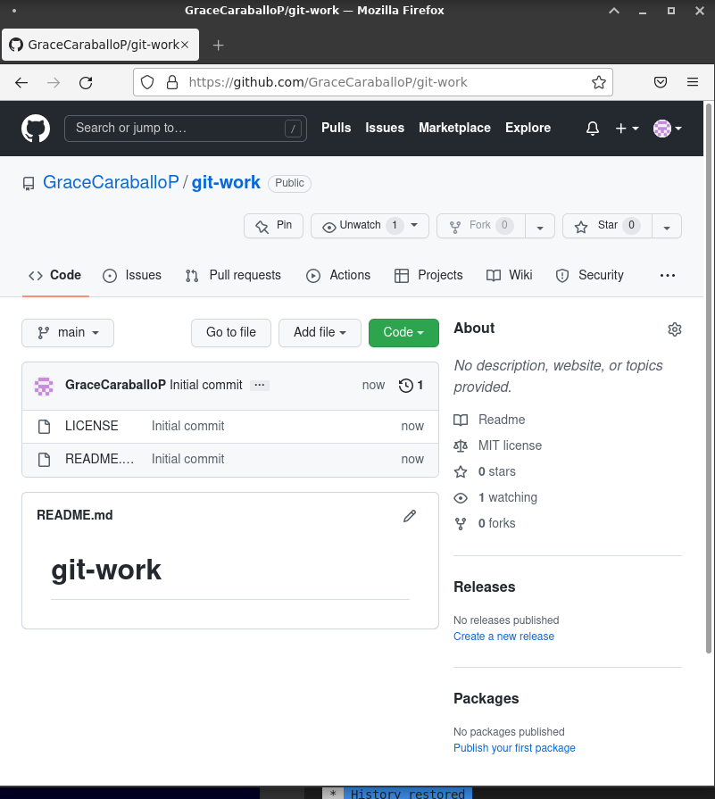
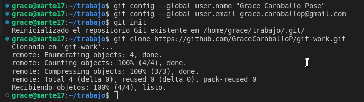
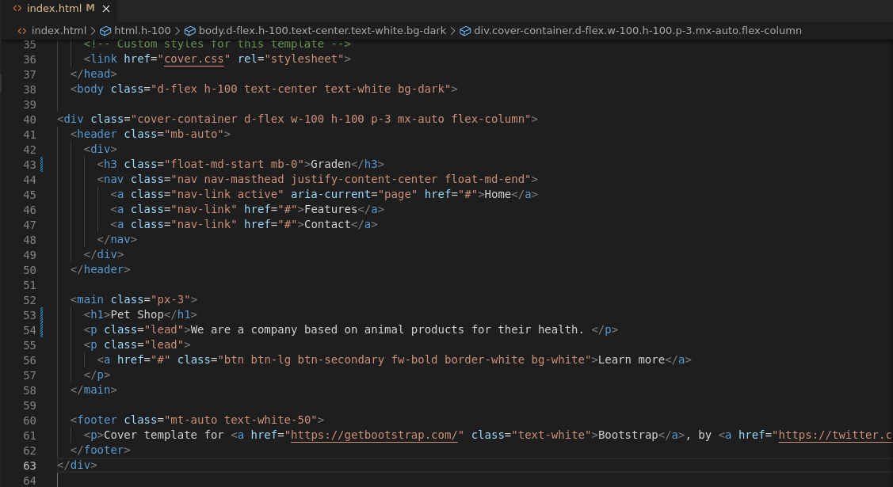
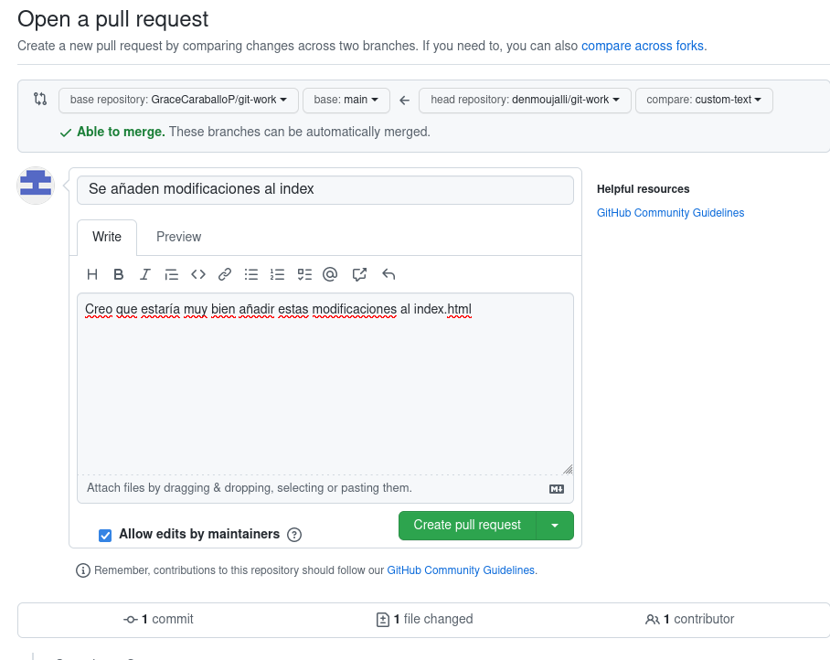
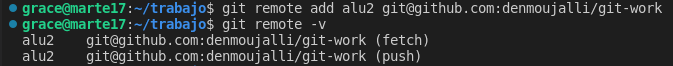

# UT1-A1: Trabajando con git
**Índice**

1. [Creación del repositorio](#1)
2. [Clonar el repositorio](#2)
3. [Hacer un fork  y clonar el repositorio](#3)
4. [Creación de nueva rama y modificaciones](#4)
5. [Petición del PR](#5)
6. [Prueba de la PR](#6)
7. [Aprobación del PR](#7)
8. [Modificaciones del css y PR](#8)
9. [Aprobación del PR y solución de posibles conflictos](#9)
10. [Etiquetado de versión](#10)

`alu1`: https://github.com/GraceCaraballoP (Grace Caraballo Pose) 

`alu2`: https://github.com/denmoujalli (Denisse Moujalli Totesaut)

## Creación del repositorio<a name="1"></a>

`alu1` creará un repositorio público **git-work** en su cuenta de GitHub, añadiendo un `README.md` y una licencia MIT.

Para la creación de este repositorio se hizo de forma gráfica y manual desde la página de GitHub.

Al crear un nuevo repositorio dentro de GitHub podremos seleccionar opciones para añadir un README.md y una licencia MIT
<div align="center">
    
</div>

## Clonar el repositorio<a name="2"></a>
`alu1` clonará el repo y añadirá los ficheros: index.html, bootstrap.min.css y cover.css. Luego subirá los cambios al _upstream_.

Antes de clonar el repositorio configuraremos los datos generales para git como lo es el usuario y el correo, utilizando los siguientes comandos: 

```
git config --global user.name "nombre"

git config --global user.email "correo"
```

Seguidamente inicializamos el repositorio en local con `git init` y finalmente hacemos el clonado del repositorio. En este caso utilizamos el método por https.

<div align="center">
    
</div>

Creamos los ficheros correspondientes y añadimos los cambios y hacemos un commit, finalmente realizamos un push al repositorio en remoto para guardar los cambios en ambos lados.

<div align="center">
    
    
    
    

</div>

## Hacer un fork  y clonar el repositorio<a name="3"></a>

`alu2` creará un fork de **git-work** desde su cuenta de GitHub.
`alu2` clonará su fork del repo.

Para realizar el fork del repositorio principal, deberemos de irnos al repositorio y nos aparecerá un símbolo en la parte superior derecha donde nos indicará la cantidad de forks que se habrán realizado en el repositorio, allí lo seleccionamos e indicaremos que queremos crear un nuevo fork.

Dentro indicaremos el nombre del repo, y se habrá marcado automáticamente la opción de copiar solo la rama main

<div align="center">
    
   
</div>

Volveremos aplicar las configuraciones necesarias en git para hacer la clonación del repo, por lo tanto se deberá de especificar el `user.name` y `user.email` una vez realizado esto si podremos hacer la clonación del repo e inicializar el repo en local.

<div align="center">
    
    
</div>

Podremos observar que en el repositorio que se ha realizado el fork, debajo del nombre del repositorio indica que es un fork realizado al repo de `alu1`.

## Creación de nueva rama y modificaciones<a name="4"></a>

Una vez inicializado el repositorio, crearemos la rama `custom-text` y haremos los cambios en el fichero index.html.

Cuando terminemos de realizar los cambios tendremos que actualizarlos con `git add .`, hacer el commit indicativo de los cambios y finalmente hacer un push al repositorio que se le ha realizado la copia del principal.

<div align="center">
    

</div>

## Petición del PR<a name="5"></a>

Para la realización del PR desde el fork al principal, una vez realizado el push nos iremos al GitHub, lo cual nos aparecerá que se ha creado una nueva rama y un botón nos indicará hacer la comparativa y solicitar el PR.

<div align="center">
    
    

</div>

## Prueba de la PR<a name="6"></a>

`alu1` para poder ver los cambios del PR de `alu2` deberá crear una rama remota hacia el repositorio de `alu2` . El primer intento ha sido como se muestra a continuación:
<div align="center">
    
</div>

Lo anterior daba un fallo al hacer el `git fetch` puesto que no se tienen los permisos necesarios y por ello se ha debido acceder desde la url donde se encuentra el repositorio y de esta forma si se han podido ver los cambios.

<div align="center">
   
</div>

Una vez probados los cambios `alu1` le propone un cambio a `alu2` el cual le parece buena idea y realiza el cambio. Una vez realizado `alu2` se lo comunica a `alu1` y este vuelve a sugerir otra modificación la cual `alu2` vuelve a aceptar y realizar.

<div align="center">


</div>

La conversación mantenida por `alu1` y `alu2` es la siguiente:

<div align="center">

</div>

## Aprobación del PR<a name="7"></a>

`alu1` al ver que está de acuerdo con la PR de `alu2` la acepta realizando un merge del PR.

<div align="center">
    /*captura del merge*/

</div>

Para que los cambios puedas ser visibles en el repositorio de `alu1` este deberá traerse los cambios con un pull

<div align="center">
    /*captura del merge*/

</div>

Cuando se haya realizado el merge de la rama de `alu2` a `alu1`, `alu2` deberá incorporar los cambios incluidos en la rama principal.

Por lo tanto añadirá el remoto del repositorio de `alu1`, se realizará un `fetch` y finalmente un merge en la rama principal para poder tener todos los cambios en local. Luego de esto se realizará un push para subir los cambios a su remoto principal.

<div align="center">


</div>

## Modificaciones del css y PR<a name="8"></a>

`alu1` cambiará la línea 10 de `cover.css` a:

```css
color: purple;
```

`alu1` hará simplemente un commit local en main.

<div align="center">

</div>

`alu2` creará una nueva rama `cool-colors` y cambiará la línea 10 de `cover.css` a:

```css
color: darkgreen;
```
Creamos una nueva rama, realizamos los cambios pertinentes y subimos los cambios.

<div align="center">


</div>

Podemos observar que al realizar el push de los últimos cambios está creando al mismo tiempo un pull de los cambios que vamos a poder visualizar en la página principal del GitHub de `alu2`.

<div align="center">

</div>

Volveremos a realizar lo mismo que se hizo con el anterior PR.

Comparamos y solicitamos el PR a `alu1`.

<div align="center">

</div>

## Aprobación del PR y solución de posibles conflictos<a name="9"></a>

`alu1` comprueba el PR de `alu2` como lo ha hecho anteriormente pero esta vez con la rama `cool-colors` 

<div align="center">

</div>

Como está de acuerdo con los cambios `alu1` mergea los cambios del PR de `alu2` 

<div align="center">

</div>

Una vez mergeado el PR `alu1` se trae los cambios sin ningún inconveniente.

<div align="center">

</div>

## Etiquetado de versión<a name="10"></a>

`alu1` crea la etiqueta de la versión como `0.1.0` y realiza un release con la etiqueta en GitHub

<div align="center">

</div>

<div align="center">

</div>

<div align="center">

</div>
