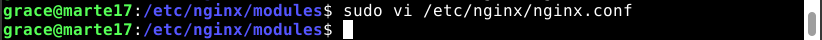

# UT3-TE1: Administración de servidores web

**Índice**
1. [Instalar el módulo ngx_small_light y cargarlo dinámicamente en Nginx.](#1)
2. [Crear un virtual host específico que atienda peticiones en el dominio images.alu7273.arkania.es (server_name).](#2)
3. [Habilitar el módulo ngx_small_light en el virtual host sólo para el location /img](#3)
4. [Subir las imágenes de images.zip a una carpeta img dentro de la carpeta de trabajo elegida.](#4)
5. [Crear una aplicación web que permita el tratamiento de dichas imágenes.](#5)
6. [Incorporar certificado de seguridad (mostrar el certificado lock).](#6)
7. [Redirigir el subdominio www al dominio base (incluyendo ssl).](#7)


# Instalar el módulo ngx_small_light y cargarlo dinámicamente en Nginx.<a name="1"></a>

`small_light` necesita de las dependencias de **PCRE** y de **ImageMagick** por tanto vamos a proceder a su descarga.

Comencamos actualizando los paquetes:

```console
sudo apt update
```

<div align="center">
  
</div>

Procedemos a la instalación de las librerías necesarias libpcre3, libpcre3-dev, imageMagick, libmagickwand-dev

```console
sudo apt install libpcre3
```

<div align="center">
  
</div>

```console
sudo apt install libpcre3-dev
```

<div align="center">
  
</div>

```console
sudo apt install imagemagick
```

<div align="center">
  
</div>

```console
sudo apt install libmagickwand-dev
```

<div align="center">
  
</div>

luego instalamos nginx con la misma versión que tenemos en el sistema

```console
curl -sL https://nginx.org/download/nginx-$(/sbin/nginx -v \
|& cut -d '/' -f2).tar.gz | tar xvz -C /tmp
```

<div align="center">
  
</div>

Procedemos a clonar el repositorio donde se encuentra  ngx_small_light

```console
git clone https://github.com/cubicdaiya/ngx_small_light.git /tmp/ngx_small_light
```

<div align="center">
  
</div>

Nos posicionamos en la carpeta que tiene los contenidos de **ngx_small_light** con `cd /tmp/ngx_small_light` y ejecutamos el `./setup` para obtener la configuracion: 

<div align="center">
  
</div>

Nos movemos a la carpeta donde hemos descargado nginx `cd /tmp/nginx-1.22.1/` y ejecutamos `./configure` con la configuración que nos indican en su página los de small_light

```console
./configure --add-dynamic-module=/tmp/ngx_small_light --with-compat
```

<div align="center">
  
</div>

Hacemos un make:
```console
make 
```

<div align="center">
  
</div>

A continuación, un make install

```console
sudo make install
```

<div align="center">
  
</div>

Copiamos el objeto que se han creado en `objs` de small_light que es `.so` a los módulos de nginx

```console
sudo cp objs/ngx_http_small_light_module.so /etc/nginx/modules
```

<div align="center">
  
</div>

Comprobamos que se ha copiado correctamente `cd /etc/nginx/modules`

<div align="center">
  
</div>

Modificamos la configuración de nginx para que cargue el módulo añadiendo `load_module /usr/local/nginx/modules/ngx_http_small_light_module.so;`

```console
sudo vi /etc/nginx/nginx.conf
```
<div align="center">
  
</div>
<div align="center">
  
</div>


# Crear un virtual host específico que atienda peticiones en el dominio images.alu7273.arkania.es (server_name).<a name="2"></a>

Para configurar el virtual host he creado el archivo de configuración `images.conf`  dentro de `/etc/nginx/conf.d/` 

<div align="center">
  
</div>

Con la siguiente configuración:

<div align="center">
  
</div>


# Habilitar el módulo ngx_small_light en el virtual host sólo para el location /img.<a name="3"></a>

Abrimos la configuración del módulo y modificamos el location de `/img`

<div align="center">
  
</div>


# Subir las imágenes de images.zip a una carpeta img dentro de la carpeta de trabajo elegida.<a name="4"></a>

Subir las imágenes de `images.zip` a una carpeta img dentro de la carpeta de trabajo elegida.
Descargo las imágenes a la carpeta de descargas en local, extraigo las imágenes a la carpeta img y la envio al directorio  /home/grace/DPL/ModImg del servidor virtual

```console
scp -r -P2222 img grace@alu7273.arkania.es:/home/grace/DPL/ModImg
```

<div align="center">
  
</div>

Compruebo que la carpeta se encuentra en el servidor

<div align="center">
  
</div>


# Crear una aplicación web que permita el tratamiento de dichas imágenes.<a name="5"></a>

Puede acceder al código fuente de la aplicación pinchando este [enlace](./src/index.html). La aplicación tiene el siguiente aspecto:

<div align="center">
  
</div>


# Incorporar certificado de seguridad (mostrar el certificado ).<a name="6"></a>

Para poder incorporar el certificado ssl a nuestra aplicación web con Certbot al no tenerlo instalado aún debemos instalarlo. Para ello actualizamos repositorios 

```console
grace@vps-554e86a8:/etc/nginx/conf.d$ sudo apt update
```

<div align="center">
  
</div>

Una vez actualizados los repositorios instalamos certbot

```console
grace@vps-554e86a8:/etc/nginx/conf.d$ sudo apt install -y certbot
```

<div align="center">
  
</div>

Una vez finalizada la instalación comprobamos que se ha realizado correctamente comprobando la versión

```console
grace@vps-554e86a8:~$ certbot --version
```
<div align="center">
  
</div>

Luego instalamos el plugin de Nginx para certbot:

```console
grace@vps-554e86a8:/etc/nginx/conf.d$ sudo apt install -y python3-certbot-nginx
```

<div align="center">
  
</div>

Lanzamos certbot  para crear el certificado de `images.alu7273.arkania.es`

```console
grace@vps-554e86a8:/etc/nginx/conf.d$ sudo certbot --nginx
Saving debug log to /var/log/letsencrypt/letsencrypt.log
Plugins selected: Authenticator nginx, Installer nginx
Enter email address (used for urgent renewal and security notices)
 (Enter 'c' to cancel): grace.caraballop@gmail.com

- - - - - - - - - - - - - - - - - - - - - - - - - - - - - - - - - - - - - - - -
Please read the Terms of Service at
https://letsencrypt.org/documents/LE-SA-v1.3-September-21-2022.pdf. You must
agree in order to register with the ACME server. Do you agree?
- - - - - - - - - - - - - - - - - - - - - - - - - - - - - - - - - - - - - - - -
(Y)es/(N)o: Y

- - - - - - - - - - - - - - - - - - - - - - - - - - - - - - - - - - - - - - - -
Would you be willing, once your first certificate is successfully issued, to
share your email address with the Electronic Frontier Foundation, a founding
partner of the Let's Encrypt project and the non-profit organization that
develops Certbot? We'd like to send you email about our work encrypting the web,
EFF news, campaigns, and ways to support digital freedom.
- - - - - - - - - - - - - - - - - - - - - - - - - - - - - - - - - - - - - - - -
(Y)es/(N)o: N
Account registered.

Which names would you like to activate HTTPS for?
- - - - - - - - - - - - - - - - - - - - - - - - - - - - - - - - - - - - - - - -
1: alu7273.arkania.es
2: images.alu7273.arkania.es
- - - - - - - - - - - - - - - - - - - - - - - - - - - - - - - - - - - - - - - -
Select the appropriate numbers separated by commas and/or spaces, or leave input
blank to select all options shown (Enter 'c' to cancel): 2
Requesting a certificate for images.alu7273.arkania.es
Performing the following challenges:
http-01 challenge for images.alu7273.arkania.es
Waiting for verification...
Cleaning up challenges
Deploying Certificate to VirtualHost /etc/nginx/conf.d/images.conf
Redirecting all traffic on port 80 to ssl in /etc/nginx/conf.d/images.conf

- - - - - - - - - - - - - - - - - - - - - - - - - - - - - - - - - - - - - - - -
Congratulations! You have successfully enabled https://images.alu7273.arkania.es
- - - - - - - - - - - - - - - - - - - - - - - - - - - - - - - - - - - - - - - -

IMPORTANT NOTES:
 - Congratulations! Your certificate and chain have been saved at:
   /etc/letsencrypt/live/images.alu7273.arkania.es/fullchain.pem
   Your key file has been saved at:
   /etc/letsencrypt/live/images.alu7273.arkania.es/privkey.pem
   Your certificate will expire on 2023-02-19. To obtain a new or
   tweaked version of this certificate in the future, simply run
   certbot again with the "certonly" option. To non-interactively
   renew *all* of your certificates, run "certbot renew"
 - If you like Certbot, please consider supporting our work by:

   Donating to ISRG / Let's Encrypt:   https://letsencrypt.org/donate
   Donating to EFF:                    https://eff.org/donate-le
```


# Redirigir el subdominio www al dominio base (incluyendo ssl).<a name="7"></a>

Para poder redireccionar las busquedas desde www.images.alu7273.arkania.es a images.alu7273.arkania.es creo el archivo de configuraciones imagesWWW.conf en `/etc/nginx/conf.d/` con la siguiente especificación:  

<div align="center">
  
</div>

<div align="center">
  
</div>

Le aplico certbot para poder acceder con certificado ssl también.

```console
grace@vps-554e86a8:/etc/nginx/conf.d$ sudo certbot --nginx

Saving debug log to /var/log/letsencrypt/letsencrypt.log
Plugins selected: Authenticator nginx, Installer nginx

Which names would you like to activate HTTPS for?
- - - - - - - - - - - - - - - - - - - - - - - - - - - - - - - - - - - - - - - -
1: alu7273.arkania.es
2: images.alu7273.arkania.es
3: www.images.alu7273.arkania.es
- - - - - - - - - - - - - - - - - - - - - - - - - - - - - - - - - - - - - - - -
Select the appropriate numbers separated by commas and/or spaces, or leave input
blank to select all options shown (Enter 'c' to cancel): 3
Requesting a certificate for www.images.alu7273.arkania.es
Performing the following challenges:
http-01 challenge for www.images.alu7273.arkania.es
Waiting for verification...
Cleaning up challenges
Deploying Certificate to VirtualHost /etc/nginx/conf.d/imagesWWW.conf
Redirecting all traffic on port 80 to ssl in /etc/nginx/conf.d/imagesWWW.conf

- - - - - - - - - - - - - - - - - - - - - - - - - - - - - - - - - - - - - - - -
Congratulations! You have successfully enabled
https://www.images.alu7273.arkania.es
- - - - - - - - - - - - - - - - - - - - - - - - - - - - - - - - - - - - - - - -

IMPORTANT NOTES:
 - Congratulations! Your certificate and chain have been saved at:
   /etc/letsencrypt/live/www.images.alu7273.arkania.es/fullchain.pem
   Your key file has been saved at:
   /etc/letsencrypt/live/www.images.alu7273.arkania.es/privkey.pem
   Your certificate will expire on 2023-02-19. To obtain a new or
   tweaked version of this certificate in the future, simply run
   certbot again with the "certonly" option. To non-interactively
   renew *all* of your certificates, run "certbot renew"
 - If you like Certbot, please consider supporting our work by:

   Donating to ISRG / Let's Encrypt:   https://letsencrypt.org/donate
   Donating to EFF:                    https://eff.org/donate-le

```