# UT4-TE1: Administración de servidores web

**Índice**

**PostgreSQL**
1. [Instalación de PostgreSQL.](#1.1)
2. [Cargue los datos de prueba para la aplicación TravelRoad.](#1.2)
3. [Instale pgAdmin tanto en desarrollo como en producción.](#1.3)
4. [Conectar un nuevo servidor TravelRoad a pgAdmin.](#1.4)

  **NOTA** Incluya en el informe la URL donde está desplegado pgAdmin y las credenciales de acceso.

**Aplicación PHP**  

  **Entorno de desarrollo**
  1. [Instale `sudo apt install -y php8.2-pgsql` para tener disponible la función pg_connect.](#2.1)
  2. [Desarrolle en local una aplicación PHP que se encargue de mostrar los datos de TravelRoad tal y como se ha visto en clase, atacando a la base de datos local.](#2.2)
  3. [Utilice control de versiones para alojar la aplicación dentro del repositorio: dpl/ut4/te1](#2.3)
  4. [Use el dominio `php.travelroad.local` para montar la aplicación en el entorno de desarrollo.](#2.4)
  5. [Utilice include en su código para incluir el fichero `config.php` que contendrá los datos de acceso a la base de datos y que no deberá incluirse en el control de versiones.](#2.5)
    
    **NOTA** Incluya en el informe el enlace al código fuente de la aplicación.

  **Entorno de producción**
  1. [Clone el repositorio en la máquina de producción.](#3.1)
  2. [Incluya el fichero `config.php` con las credenciales de acceso a la base de datos de producción.](#3.2)
  3. [Configure un virtual host en producción para servir la aplicación PHP en el dominio `php.travelroad.alu7273.arkania.es`.](#3.3)
  4. [Incluya certificado de seguridad y redirección `www`.](#3.4)

    **NOTA** Incluya en el informe la URL donde está desplegada la aplicación.

  **Despliegue**
  1. [Cree un shell-script `deploy.sh` (con permisos de ejecución) en la carpeta de trabajo del repositorio, que se conecte por ssh a la máquina de producción y ejecute un `git pull` para actualizar los cambios.](#4.1)
  2. [Pruebe este script tras haber realizado algún cambio en la aplicación.](#4.2)


## **PostgreSQL**
<div align="center">
  
</div>

### Instalación de PostgreSQL.<a name="1.1"></a>

Comenzamos actualizando los paquetes 

```
sudo apt update
```

Luego instalamos las siguientes dependencias:

```
sudo apt install -y apt-transport-https
```

<div align="center">
  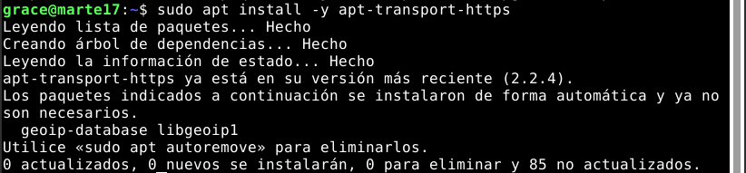
</div>

Y descargamos las claves de firma del repositorio oficial de **PostgreSQL**

```
curl -fsSL https://www.postgresql.org/media/keys/ACCC4CF8.asc \
| sudo gpg --dearmor -o /etc/apt/trusted.gpg.d/postgresql.gpg
```

<div align="center">
  
</div>

Añadimos el repositorio oficial de **PostgreSQL**

```
echo 'deb http://apt.postgresql.org/pub/repos/apt/ bullseye-pgdg main' \
| sudo tee /etc/apt/sources.list.d/postgresql.list > /dev/null
```

<div align="center">
  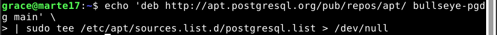
</div>

Volvemos a actualizar los paquetes:

```
sudo apt update
```

<div align="center">
  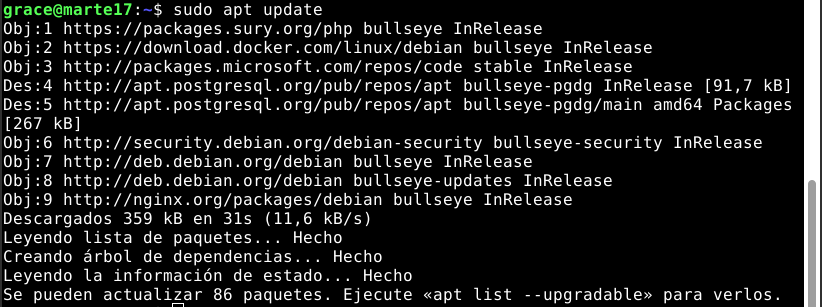
</div>

Buscamos las versiones disponibles de PostgreSQL

```
apt-cache search --names-only 'postgresql-[0-9]+$' | sort
```

<div align="center">
  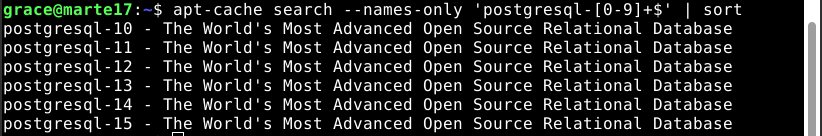
</div>


E instalamos la más reciente, en nuestro caso la 15.

```
sudo apt install -y postgresql-15
```

<div align="center">
  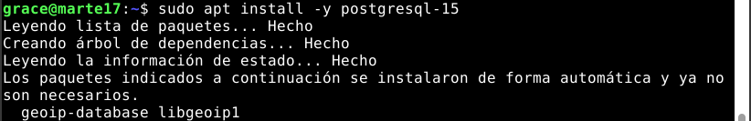
</div>

Una vez finalizada la instalación comprobamos que se ha realizado correctamente comprobando la versión de PostgreSQL

```
psql --version
```

<div align="center">
  
</div>

#### Configuración de PostgreSQL

Para poder permitir el acceso externo a nuestro PostgreSQL debemos acceder al al fichero `/etc/postgresql/15/main/postgresql.conf`. Y añadir en la línea 64 lo siguiente(nos permitirá escuchar en cualquier IP):

```
listen_address=’*’
```

<div align="center">
  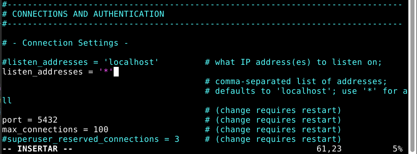
</div>

Una vez echo lo anterior debemos modificar también el fichero `/etc/postgresql/15/main/pg_hba.conf`. Añadiendo al final de este lo siguiente:

```
host travelroad travelroad_user 0.0.0.0/0 md5
```

<div align="center">
  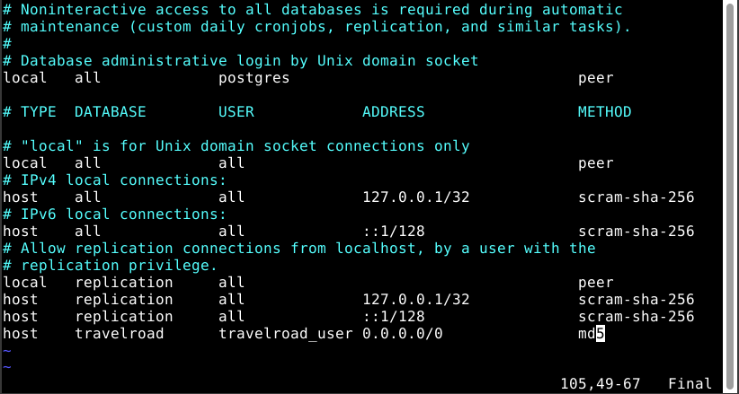
</div>

Tras los cambios debemos reiniciar el servicio para que los cambios se hagan efectivos.

```
sudo systemctl restart postgresql
```

### Cargue los datos de prueba para la aplicación TravelRoad.<a name="1.2"></a>

Abrimos postgresql

```
sudo -u postgres psql
```

Crear el usuario `travelroad_user` y la base de datos `travelroad` para el usuario creado:

```
CREATE USER travelroad_user WITH ENCRYPTED PASSWORD 'pass';
CREATE DATABASE travelroad WITH OWNER travelroad_user;
 \q (para salir)

```

<div align="center">
  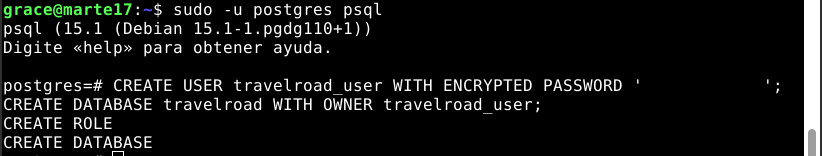
</div>

Iniciar postgresql con el usuario creado anteriormente:

```
psql -h localhost -U travelroad_user travelroad
```

Crear la tabla `places`:

```
CREATE TABLE places(
id SERIAL PRIMARY KEY,
name VARCHAR(255),
visited BOOLEAN);
```

<div align="center">
  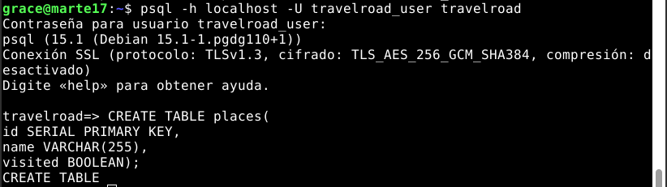
</div>

Descargar el archivo `places.csv` para luego cargar los datos en la base de datos:

```
curl -o /tmp/places.csv https://raw.githubusercontent.com/sdelquin/dpl/main/ut4/files/places.csv
```

<div align="center">
  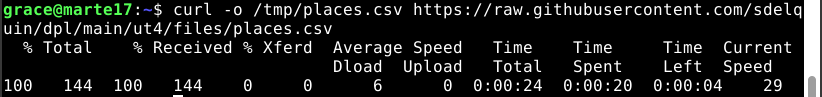
</div>

Cargar los datos desde el fichero `places.csv` a la tabla `places`:

```
psql -h localhost -U travelroad_user -d travelroad \
-c "\copy places(name, visited) FROM '/tmp/places.csv' DELIMITER ','"
```

<div align="center">
  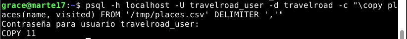
</div>

Una vez hecho lo anterior los datos ya estarían cargados a la tabla places. Accedemos a la base de datos con nuestro usuario:

```
psql -h localhost -U travelroad_user travelroad
```

Comprobamos que se han insertado datos en la tabla:

```
SELECT * FROM places;
```

<div align="center">
  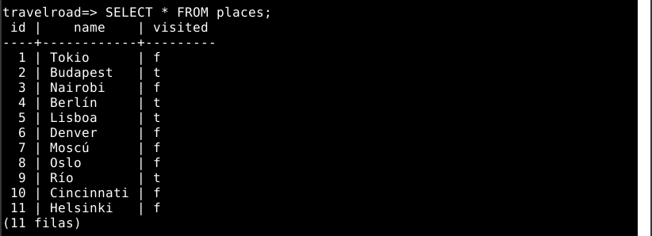
</div>


### Instale pgAdmin tanto en desarrollo como en producción.<a name="1.3"></a>

Comenzaremos haciendo lo siguiente para asegurarnos que la ruta a los binarios están en el PATH:

```
echo 'export PATH=~/.local/bin:$PATH' >> .bashrc && source .bashrc
```

<div align="center">
  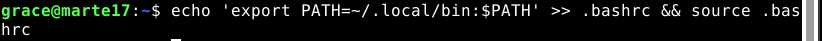
</div>

A continuación instalaremos [Python](../../../../../Python) en caso de no tenerlo instalado puede instalarlo siguiendo lo pasos que se muestran clicanco en Python.

Una vez instalado Python creamos las carpetas de trabajo `/var/lib/pgadmin` y `/var/log/pgadmin`. 

```
sudo mkdir /var/lib/pgadmin
sudo mkdir /var/log/pgadmin
```

Le damos permisos a nuestro usuario de poder acceder a ellas:

```
sudo chown $USER /var/lib/pgadmin
sudo mkdir /var/log/pgadmin
```
<div align="center">
  
</div>

Creamos y activamos un entorno virtual de Python llamado `pgadmin4`:

```
python -m venv pgadmin4
source pgadmin4/bin/activate
```

Instalamos `pgadmin4`

```
pip install pgadmin4
```

<div align="center">
  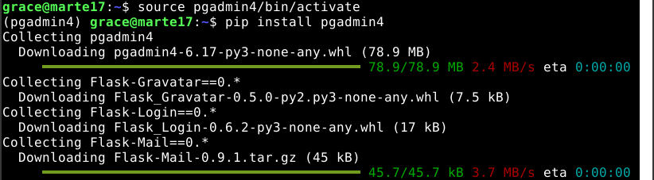
</div>

Una vez instalado `pgadmin` lanzamos el script de configuración donde lo completaremos con nuestros datos:

```
pgadmin4
```

<div align="center">
  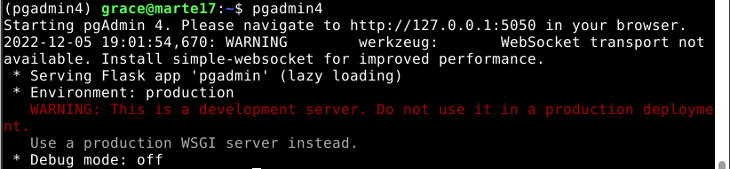
</div>

Después de configurarlo instalamos `gunicorn`

```
pip install gunicorn
```

<div align="center">
  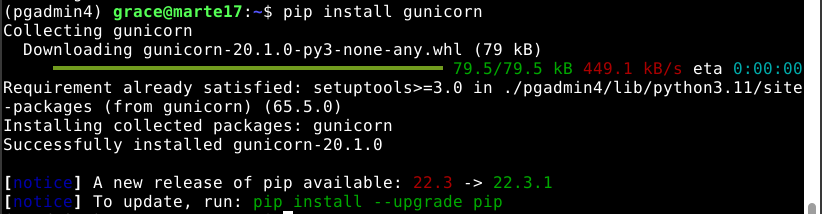
</div>


Abrimos otra terminal y creamos la configuración de `pgadmin`, con el archivo llamado `pgadmin.conf` ubicado en `/etc/nginx/conf.d/` con lo siguiente:

```
server {
    server_name pgadmin.local.es;

    location / {
        proxy_pass http://unix:/tmp/pgadmin4.sock;
    }
}
```

<div align="center">
  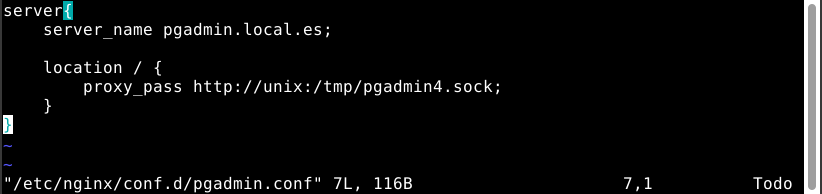
</div>

A continuación añadiremos `pgadmin.local.es` a los hosts para poder acceder a dicha dirección: 

<div align="center">
  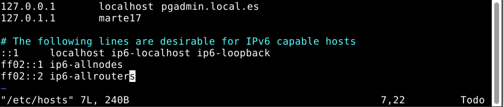
</div>

Comprobamos que podemos acceder a `pgadmin.local.es`:

<div align="center">
  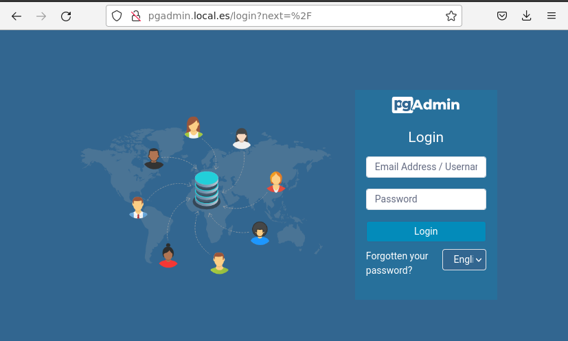
</div>


Creamos un demonio para no tener que levantar el servicio cada vez que queramos acceder a `pgadmin.local.es`. Para ello crearemos el fichero `pgadmin.service` en `/etc/systemd/system/`.

```
[Unit]
Description=grace

[Service]
User=sdelquin
ExecStart=/bin/bash -c '\
source /home/grace/pgadmin4/bin/activate && \
gunicorn --chdir /home/grace/pgadmin4/lib/python3.11/site-packages/pgadmin4 \
--bind unix:/tmp/pgadmin4.sock \
pgAdmin4:app'
Restart=always

[Install]
WantedBy=multi-user.target
```

> Tener en cuenta que se debe poner el usuario y la ruta adecuada según el usuario.

### Conectar un nuevo servidor TravelRoad a pgAdmin.<a name="1.4"></a>
  
Para conectar un nuevo servidor debemos acceder a pgAdmin. A continuación pulsamos con botón derecho y vamos a Register → Servidor:

<div align="center">
  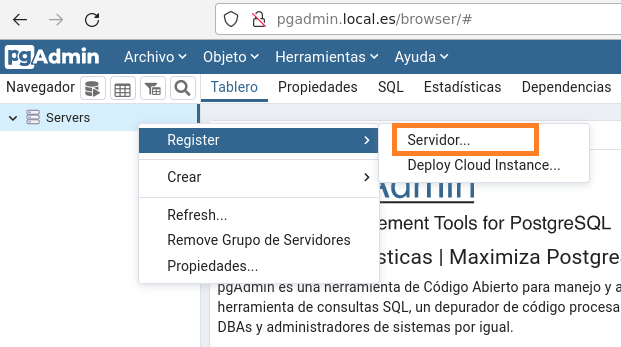
</div>

Para configurar el servidor vamos a la pestaña de General y como nombre le pondremos TravelRoad:

<div align="center">
  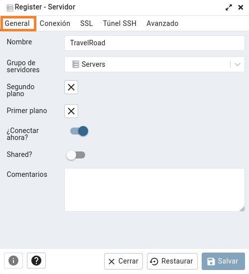
</div>

Luego en Conexión escribimos el host, nombre de la base de datos, usuario y contraseña. En mi caso también lo he configurado para que guarde la contraseña también:

<div align="center">
  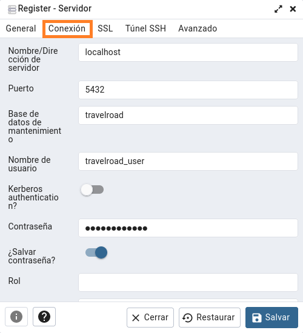
</div>

Una vez realizado lo anterior pulsamos en salvar y obtendremos algo como lo siguiente:

<div align="center">
  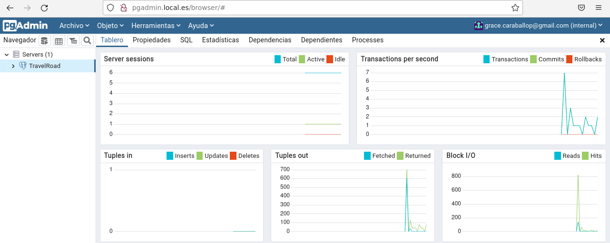
</div>

## Aplicación PHP

### Entorno de desarrollo

#### Instale sudo apt install -y php8.2-pgsql para tener disponible la función pg_connect.<a name="2.1"></a>

Para instalar `php8.2-pgsql` primero actualizaremos repositorios:

```
sudo apt update
```

Y luego instalaremos con:

```
sudo apt install -y php8.2-pgsql
```

<div align="center">
  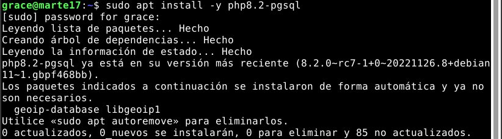
</div>

> Como se puede observar yo ya lo tenía instalado en la última versión disponible.

#### Desarrolle en local una aplicación PHP que se encargue de mostrar los datos de TravelRoad tal y como se ha visto en clase, atacando a la base de datos local.<a name="2.2"></a>

El código de la aplicación se puede encontrar en el siguiente [enlace](src/).

#### Utilice control de versiones para alojar la aplicación dentro del repositorio: dpl/ut4/te1<a name="2.3"></a>

Nos posicionamos en la carpeta que queremos subir a repositorios y hacemos in `git add .` para añadir los archivos de la carpeta deseada, en este caso `src`. Compruebo con git status los archivos a subir:

<div align="center">
  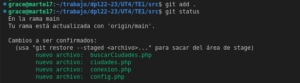
</div>

Como vemos `.gitignore` no está funcionando por lo que hago `git restore --staged config.php` para que no se suba `config.php` y colvemos a ver el estado:
 
<div align="center">
  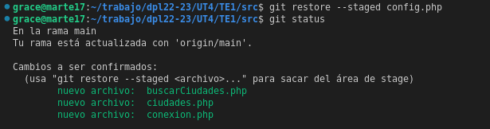
</div>

Como ya está todo correcto hacemos el commit de los cambios con `git commit -m "Mensaje"` y como todo va bien hacemos un push para subir los cambios:

<div align="center">
  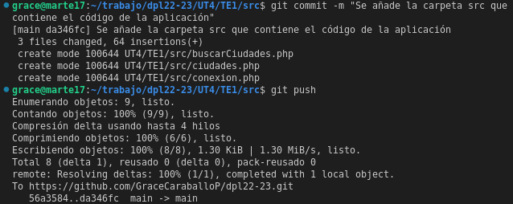
</div>

> NOTA: Después de esto cambio el nombre del archivo `ciudades.php` por `index.php`.

#### Use el dominio php.travelroad.local para montar la aplicación en el entorno de desarrollo.<a name="2.4"></a>

Para usar el dominio `php.travelroad.local` creo el fichero de configuración `travelroad.conf` en `/etc/nginx/conf.d/` con la siguiente configuración:

<div align="center">
  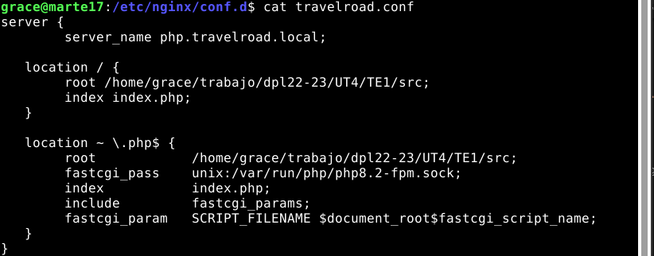
</div>

Añado el dominio `php.travelroad.local` en la configuracion del localhost ubicado en `/etc/hosts`:

<div align="center">
  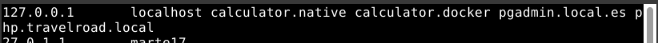
</div>

Compruebo que funciona correctamente:

<div align="center">
  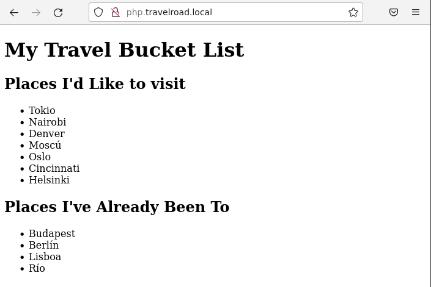
</div>


#### Utilice include en su código para incluir el fichero config.php que contendrá los datos de acceso a la base de datos y que no deberá incluirse en el control de versiones.<a name="2.5"></a>

Como se puede observar a continuación y en [conexion.php](src/conexion.php). hago un require_once para incluir config.php

<div align="center">
  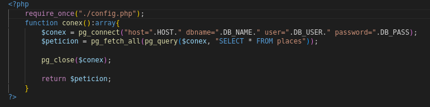
</div>


### Entorno de producción
#### Clone el repositorio en la máquina de producción.<a name="3.1"></a>

Clono el repositorio mediante clave SSH:

<div align="center">
  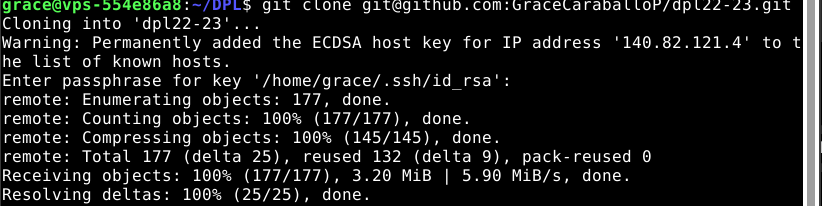
</div>

#### Incluya el fichero config.php con las credenciales de acceso a la base de datos de producción.<a name="3.2"></a>

Añado el fichero `config.php` en la ruta necesaria en mi caso `/home/grace/DPL/dpl22-23/UT4/TE1/src`

<div align="center">
  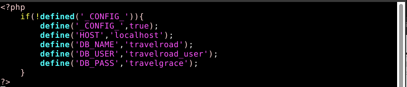
</div>

#### Configure un virtual host en producción para servir la aplicación PHP en el dominio php.travelroad.alu7273.arkania.es.<a name="3.3"></a>

Se crea `travelroad.conf` para configurar que la aplicación funcione en el dominio [php.travelroad.alu7273.arkania.es](https://php.travelroad.alu7273.arkania.es) 

<div align="center">
  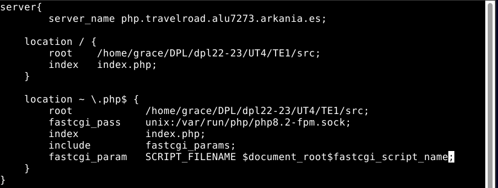
</div>

El resultado de `php.travelroad.alu7273.arkania.es` es:

<div align="center">
  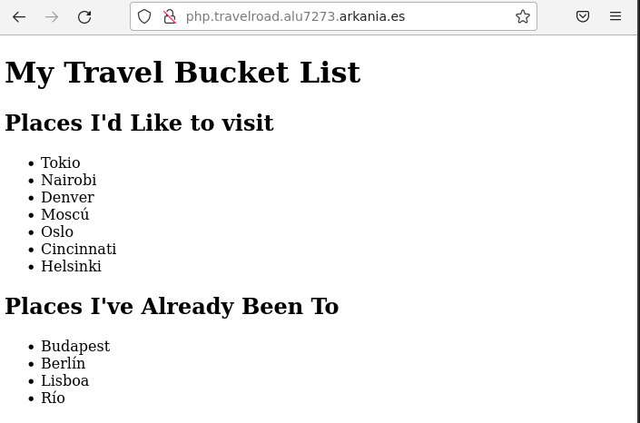
</div>


#### Incluya certificado de seguridad y redirección www.<a name="3.4"></a>

Lanzo certbot para crear el certificado de seguridad para [php.travelroad.alu7273.arkania.es](https://php.travelroad.alu7273.arkania.es):

<div align="center">
  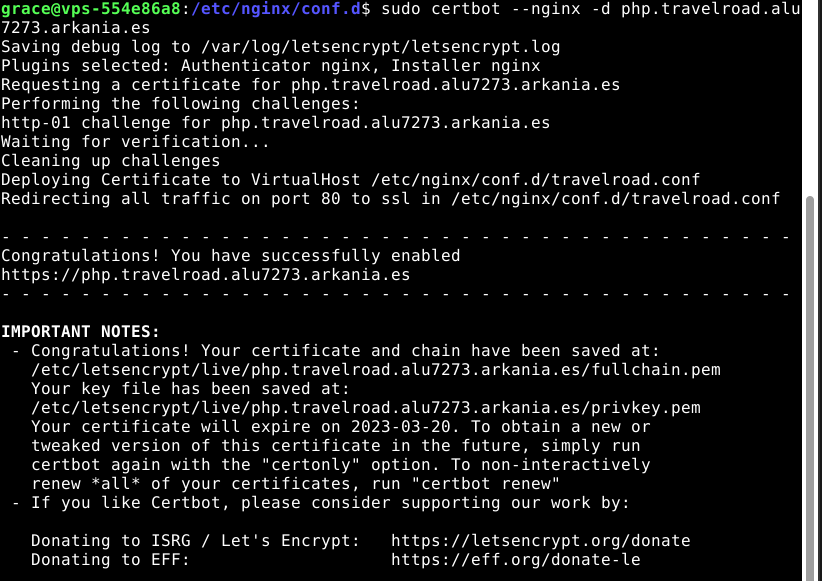
</div>

Para redirigirlo desde [www.php.travelroad.alu7273.arkania.es](http://www.php.travelroad.alu7273.arkania.es) a [php.travelroad.alu7273.arkania.es](https://php.travelroad.alu7273.arkania.es) creo el fichero de configuracion `wwwtravelroad.conf` el cual lo creo en `/etc/nginx/conf.d/` con lo siguiente:

<div align="center">
  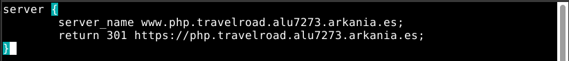
</div>

También certbot para crear el certificado de seguridad para [www.php.travelroad.alu7273.arkania.es](https://www.php.travelroad.alu7273.arkania.es):

<div align="center">
  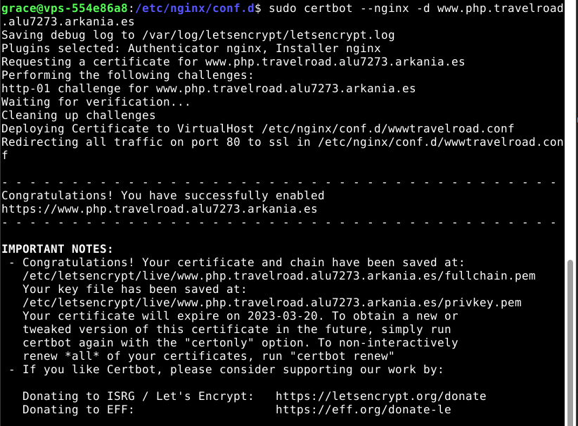
</div>

### Despliegue
#### Cree un shell-script deploy.sh (con permisos de ejecución) en la carpeta de trabajo del repositorio, que se conecte por ssh a la máquina de producción y ejecute un git pull para actualizar los cambios.<a name="4.1"></a>

Creo el script `deploy.sh` para actualizar el entorno de producción al lanzarlo con el siguiente contenido:

```
ssh arkania 'cd /home/grace/DPL/dpl22-23/; git pull;'
```

<div align="center">
  
</div>

Le daremos permisos de ejecución para poder ejecutarlo:

```
sudo chmod u+x deploy.sh
```
<div align="center">
  
</div>


#### Pruebe este script tras haber realizado algún cambio en la aplicación.<a name="4.2"></a>

Centro todo el texto del body del archivo subo los cambios, me situo en el directorio donde tengo el script y lanzo el script con `./deploy.sh`. El cambio se puede ver a continuación:

<div align="center">
  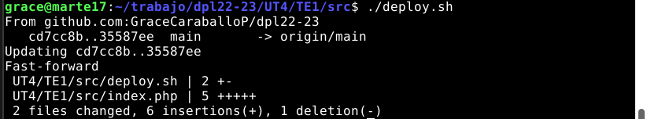
</div>

<div align="center">
  <div>
    <p><strong>Antes:</strong><p>
    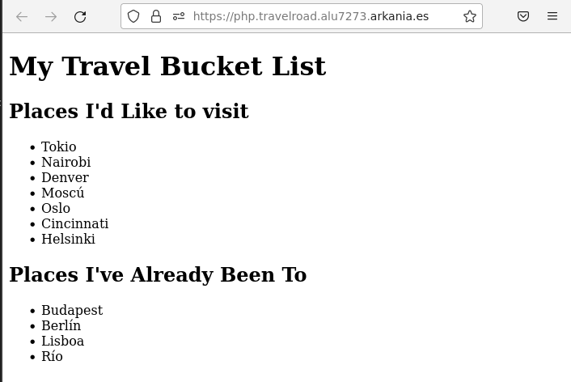
  </div>
  <div>
    <p><strong>Despues:</strong><p>
    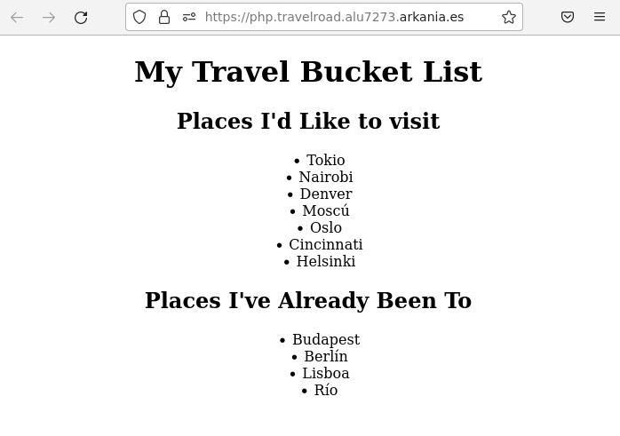
  </div>
</div>
