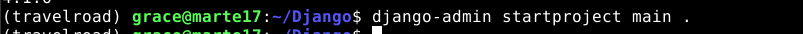
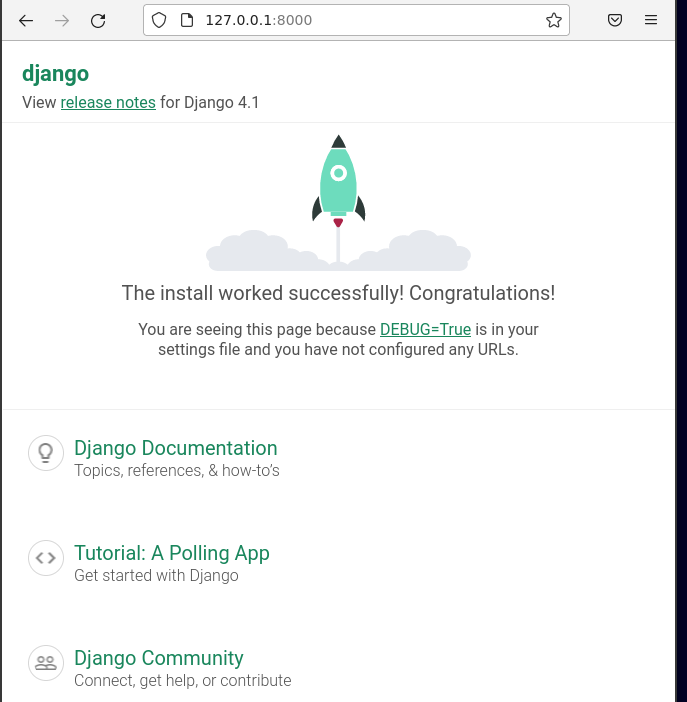
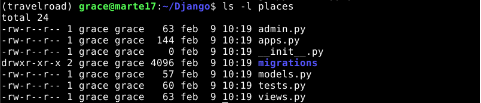
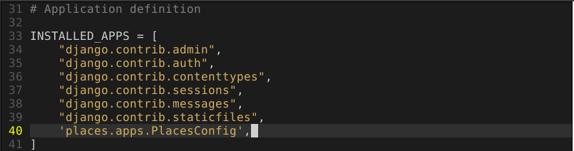
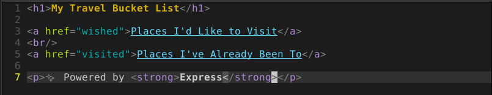
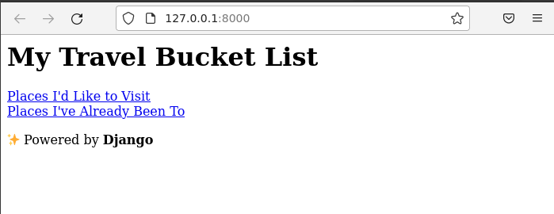
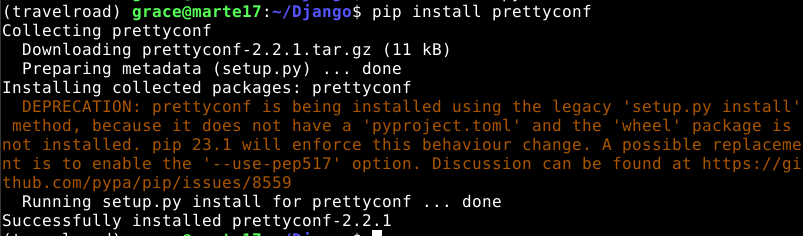
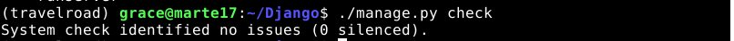

## DJANGO<a name="2"></a>

<div align="center">
  
</div>

**Índice**
1. [Instalación](#1)
2. [Crear proyecto](#2)
3. [Código de aplicación](#3)
4. [URLs](#4)
5. [Probando la aplicación en local](#5)
6. [Parametrizando la configuración](#6)
7. [Especificación de requerimientos](#7)
8. [Entorno de producción](#8)


## Instalación<a name="1"></a>

### Python

Django es un framework escrito en Python, que se4 base en el patrón de modelo–vista–controlador (MVC).

Por tanto comenzaremos por instalar Python para poder trabajar en la aplicación web. Para ello puedes seguir esta [guía](https://github.com/GraceCaraballoP/Python).

### Entorno virtual

En Python se trabaja normalmente con entornos virtuales lo que permite aislar las dependencias de nuestro proyecto con respecto a otros proyectos o al sistema operativo.

Para crear el entorno virtual `travelroad` ejecutamos lo siguiente:

```
python -m venv --prompt travelroad .venv
```
<div align="center">
  
</div>

Y lo activamos con:

```
source .venv/bin/activate
```

<div align="center">
  
</div>


Los nuevos paquetes que instalemos dentro del entorno virtual se almacenarán en la carpeta `.venv`:


### Django

Para instalar Django y sus dependencias la herramienta pip (Package Installer for Python):

```
pip install django
```

<div align="center">
  
</div>

Podemos comprobar la versión instalada de Django con el siguiente comando:

```
python -m django --version
```

<div align="center">
  
</div>

## Crear proyecto<a name="2"></a>


Creamos la estructura del proyecto con `django-admin` que nos proporciona Django:

```
django-admin startproject main .
```

<div align="center">
  
</div>

Comprobamos el contenido de la carpeta de trabajo con un `tree`:

<div align="center">
  
</div>

Lanzamos el servidor de desarrollo con la herramienta `manage.py`:

```
./manage.py runserver
```

<div align="center">
  
</div>

Accedemos a [localhost:8000](http://127.0.0.1:8000/) como nos indica en el paso anterior al lanzar el servidor y comprobamos que está funcionando:

<div align="center">
  
</div>

## Código de aplicación<a name="3"></a>

Un proyecto en Django está formado por "aplicaciones". Por tanto comenzaremos por crear nuestra primer aplicación:

```
./manage.py startapp places
```

<div align="center">
  
</div>

Con lo anterior se debe haber creado un directorio que contiene la aplicación places con el siguiente contenido:

```
ls -l places
```

<div align="center">
  
</div>


Para poder activar la aplicación para que Django sepa de que existe. Debemos acceder al fichero `main/settings.py` y añadir `'places.apps.PlacesConfig',` dentro de `INSTALLED_APPS`:

```
vi main/settings.py
```
```
...
INSTALLED_APPS = [
    'django.contrib.admin',
    'django.contrib.auth',
    'django.contrib.contenttypes',
    'django.contrib.sessions',
    'django.contrib.messages',
    'django.contrib.staticfiles',
    # Nueva línea ↓
    'places.apps.PlacesConfig',
]
...
```
<div align="center">
  
</div>

### Acceso a la base de datos

Antes de acceder a la base de datos debemos instalar un paquete de soporte denominado `psycopg2` que nos ayudará a conectar Python con bases de datos PostgreSQL:

```
pip install psycopg2
```
<div align="center">
  
</div>

Una vez instalado `psycopg2` establecemos las credenciales de acceso a la base de datos que se encuentran en `main/settings.py`:

```
vi main/settings.py
```
Dentro de este fichero nos dirigimos al aprtado de `DATABASES` y lo dejamos de la siguiente manera:

```
DATABASES = {
    'default': {
        'ENGINE': 'django.db.backends.postgresql',
        'NAME': 'travelroad',
        'USER': 'travelroad_user',
        'PASSWORD': '*******',
        'HOST': 'localhost',
        'PORT': 5432,
    }
}
```
<div align="center">
  
</div>

>**Nota:** Tener en cuenta que debemos escribir los datos referentes a nuestra base de datos y ******* es el pasword de acceso de nuestro usuario.

Hacemos uso de `check` dentro de `manage.py` para comprobar que todo esté bien:

```
./manage.py check
```
<div align="center">
  
</div>

### Modelos

En Django existe un ORM que permite mapear clases escritas en Python con entidades relacionales de la base de datos.

Creamos nuestro modelo de lugares:

```
vi places/models.py
```
Al que le añadimos:

```
from django.db import models

# Create your models here.
class Place(models.Model):
    name = models.CharField(max_length=255)
    visited = models.BooleanField()

    class Meta:
        # ↓ necesario porque ya partimos de una tabla creada ↓
        db_table = "places"

    def __str__(self):
        return self.name
```
<div align="center">
  
</div>

### Vistas

Creamos la vista que gestionará las peticiones a la página principal:

```
vi places/views.py
```

con el siguiente contenido:

```
# from django.shortcuts import render
 
# Create your views here.
from django.http import HttpResponse
from django.template import loader

from .models import Place
  
def index(request):                                                         
    template = loader.get_template('places/index.html')
    context = {
    }
    return HttpResponse(template.render(context,request))

def visited(request):
    visited = Place.objects.filter(visited=True)
    template = loader.get_template('places/visited.html')
    context = {
        'visited': visited,
    }
    return HttpResponse(template.render(context, request))

def wished(request):
    wished = Place.objects.filter(visited=False)
    template = loader.get_template('places/wished.html')
    context = {
        'wished': wished,
    }
    return HttpResponse(template.render(context, request))

```
<div align="center">
  
</div>


### Plantillas

Después de las vistas creamos las plantillas.Para ello creamos los siguientes directorios:

```
mkdir -p places/templates/places
```

#### index.html
Creamos el archivo `index.html`

```
vi places/templates/places/index.html
```

Con lo siguiente:

```
<h1>My Travel Bucket List</h1>

<a href="wished">Places I'd Like to Visit</a>
<br/>
<a href="visited">Places I've Already Been To</a>

<p>✨ Powered by <strong>Express</strong></p> 
```

<div align="center">
  
</div>

#### visited.html

```
vi places/templates/places/visited.html
```

Con lo siguiente:

```
<h1>Places I've Already Been To</h1>

<ul>
  
    <li>{{ place }}</li>
  
</ul>
 
<a href="./"><- Back Home</a>
```
<div align="center">
  
</div>

#### wished.html

```
vi places/templates/places/wished.html
```

Con lo siguiente:

```
<h1>Places I'd Like to Visit</h1>

<ul>
  
    <li>{{ place }}</li>
  
</ul>

<a href="./"><- Back Home</a>
```

<div align="center">
  
</div>

## URLs<a name="4"></a>

Ahora debemos vincular las URLs con su respectiva vista.

Comenzamos creando el archivo de URLs para `places`:

```
vi places/urls.py
```

Con lo siguiente:

```
from django.urls import path

from . import views

app_name = 'places'

urlpatterns = [
  path('', views.index, name='index'),
  path('visited', views.visited, name='visited'),
  path('wished', views.wished, name='wished'),
]
```

<div align="center">
  
</div>

A continuación vinculamos estas URLs desde el fichero principal:

```
vi main/urls.py
```
Con el siguiente contenido

```
from django.contrib import admin
from django.urls import path    
# NUEVA LÍNEA ↓
from django.urls import include, path

urlpatterns = [
    path('admin/', admin.site.urls),
    # NUEVA LÍNEA ↓
    path('', include('places.urls', 'places')),
]
```

<div align="center">
  
</div>

## Probando la aplicación en local<a name="5"></a>

Para comprobar sque funciona correctamente solo debemos echar a correr el servidor:

```
./manage.py runserver
```

Como nos indica accedemos a http://localhost:8000 y vemos que está funcionando:

**index**

<div align="center">
  
</div>

**visited**

<div align="center">
  
</div>

**wished**

<div align="center">
  
</div>

<hr>

## Parametrizando la configuración<a name="6"></a>

Queremos que las credenciales a la base de datos sea un elemento configurable en función del entorno en el que estemos trabajando.

Para que las credenciales de la base de datos se puedan configurar dependiendo del entorno en el que trabajemos  usaremos un paquete de Python llamado prettyconf que sirve para cargar variables de entorno mediate un fichero de configuración.

Comenzamos instalando dicho paquete:

```
pip install prettyconf
```
<div align="center">
  
</div>

Modificamos el fichero `settings.py` que se encuentra en `main` para aprovechar las funcionalidades del paquete:

```
vi main/settings.py
```

Con lo siguiente:

...
from pathlib import Path
# ↓ Nueva línea
from prettyconf import config
# ↑ Nueva línea
...
DEBUG = config('DEBUG', default=True, cast=config.boolean)
ALLOWED_HOSTS = config('ALLOWED_HOSTS', default=[], cast=config.list)
...
DATABASES = {
    'default': {
        'ENGINE': 'django.db.backends.postgresql',
        'NAME': config('DB_NAME', default='travelroad'),
        'USER': config('DB_USERNAME', default='travelroad_user'),
        'PASSWORD': config('DB_PASSWORD', default='******'),
        'HOST': config('DB_HOST', default='localhost'),
        'PORT': config('DB_PORT', default=5432, cast=int)
    }
}
...

>**Nota:** Como siempre con ****** nos referimos a la contrasela de nuestro usuario de la base de datos.

<div align="center">
  
</div>

<div align="center">
  
</div>

<div align="center">
  
</div>

Comprobamos que todo está correcto con:

```
./manage.py check
```

<div align="center">
  
</div>

## Especificación de requerimientos<a name="7"></a>

Debemos especificar en un fichero los requerimientos o dependencias para poder clonarlo en cualquier entorno virtual. Para ello creamos el fichero `requirements.txt` en el cual especificamos los paquetes que hemos ultilizado:

```
django
psycopg2
prettyconf
```

<div align="center">
  
</div>


## Entorno de producción<a name="8"></a>

