# LARAVEL

<div align="center">
  
</div>

**Índice**
1. [Instalación](#1)
2. [Crear aplicación](#2)
3. [Producción](#3)
4. [Script de despliegue](#4)
5. [Despliegue](#5)
6. [Certificado de Seguridad](#6)


## Instalación<a name="1"></a>

Instalamos Composer como gestor de dependencias para PHP. Para ello ello hacemos lo siguiente:

```
curl -fsSL https://raw.githubusercontent.com/composer/getcomposer.org/main/web/installer \
| php -- --quiet | sudo mv composer.phar /usr/local/bin/composer
```
<div align="center">
  
</div>

Comprobamos la versión instalada. En nustro caso la `2.5.1`.

```
composer --version
```
<div align="center">
  
</div>

Necesitamos algunos módulos PHP, por ello actualizamos los repositorios e instalamos los siguientes paquetes de soporte:

```
sudo apt update
```
<div align="center">
  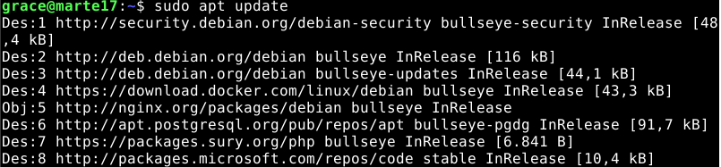
</div>


```
sudo apt install -y php8.2-mbstring php8.2-xml \
php8.2-bcmath php8.2-curl php8.2-pgsql
```
<div align="center">
  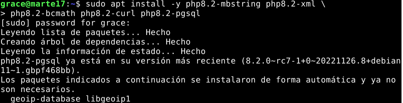
</div>

## Crear aplicación<a name="2"></a>
Creamos el directorio Laravel que será donde crearemos la estructura de la aplicación. Y nos posicionamos en dicho directorio: 

<div align="center">
  
</div>

Crear estructura de la aplicación utilizando `composer` indicando el paquete `laravel/laravel` y el nombre de la aplicación `travelroad`. 

```
composer create-project laravel/laravel travelroad
```

<div align="center">
  
</div>

Nos posicionamos en el directorio travelroad creado y vemos su composición.

<div align="center">
  
</div>

Comprobamos que se ha instalado correctamente `artisan` preguntando por su versión:

```
./artisan --version
```
<div align="center">
  
</div>

Modificamos el archivo de configuración `.env` que se crea por defecto con los datos de nuestra base de datos, en mi caso:

```
...
APP_NAME=TravelRoad
APP_ENV=development
...
DB_CONNECTION=pgsql
DB_HOST=127.0.0.1
DB_PORT=5432
DB_DATABASE=travelroad
DB_USERNAME=travelroad_user
DB_PASSWORD=********
...
```
<div align="center">
  
</div>

Continuamos configurando nginx. Para ello comenzaremos asignando los persmisos necesarios para que se pueda trabajar sin problemas de acceso.

``` 
sudo chgrp -R nginx storage bootstrap/cache
sudo chmod -R ug+rwx storage bootstrap/cache
```
<div align="center">
  
</div>

Configuramos el archivo de configuración `travelroad.conf` que se encontrará en `/etc/nginx/conf.d/` con lo siguiente:

```
server {
    server_name travelroad;
    root /home/grace/Laravel/travelroad/public;

    index index.html index.htm index.php;

    location / {
        try_files $uri $uri/ /index.php?$query_string;
    }

    location ~ \.php$ {
        fastcgi_pass unix:/var/run/php/php8.2-fpm.sock;
        fastcgi_param SCRIPT_FILENAME $realpath_root$fastcgi_script_name;
        include fastcgi_params;
    }
}
```

<div align="center">
  
</div>

Comprobamos que la sintaxis del fichero de configuración es correcta con:

```
sudo nginx -t
``` 
<div align="center">
  
</div>

Como vemos que no hay fallos recargamos la configuración de nginx:

```
sudo systemctl reload nginx
```
<div align="center">
  
</div>

Añadimos el servidor `travelroad` al fichero `/etc/hosts`

<div align="center">
  
</div>

Accedemos a `http://travelroad` para comprobar que funciona correctamente:

<div align="center">
  
</div>

Para poder cargar los datos que deseamos y mostrarlos debemos acceder al archivo `web.php` generado en `routes/`:

```
vi /routes/web.php
```

<div align="center">
  
</div>

Lo modificamos para hacer las consultas que necesitaremos:

```
<?php

use Illuminate\Support\Facades\DB;

Route::get('/', function () {
  return view('travelroad');  
});

Route::get('/visited', function () {
  $visited = DB::select('select * from places where visited = true');

return view('visited',['visited' => $visited]);  
});

Route::get('/wished', function () {
  $wished = DB::select('select * from places where visited = false');

return view('wished',['wished' => $wished]);  
});
```
<div align="center">
  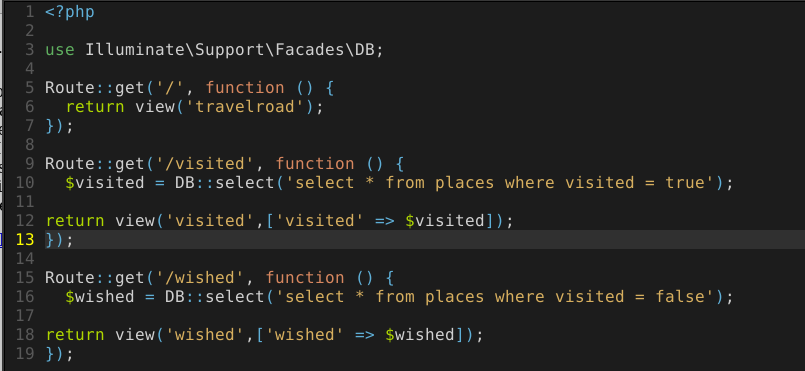
</div>

A continuación creamos la plantilla `travelroad.blade.php` ubicada en `/resources/views/` que hace uso de las consultas anteriores:

<div align="center">
  
</div>

Luego creamos la plantilla `wished.blade.php` y `wished.blade.php` también ubicadas en `/resources/views/`: 

**visited.blade.php**
<div align="center">
  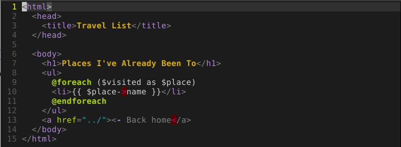
</div> 

**wished.blade.php**
<div align="center">
  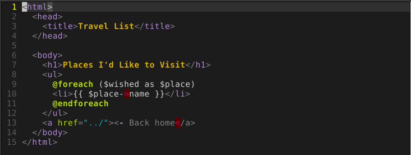
</div>

## Producción<a name="3"></a>
Cargamos los [archivos](./src/Laravel/travelroad/) relativos a la aplicación en github.

## Script de despliegue<a name="4"></a>

Creamos el script de despliegue [deploy.sh](./src/Laravel/deploy.sh)

```
ssh arkania "cd /home/grace/DPL/dpl22-23/UT4/TE2/src/Laravel/travelroad; git pull; composer install"
```

<div align="center">
  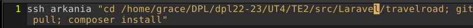
</div>

Le damos permisos de ejecución a dicho script.

```
chmod +x deploy.sh
```

<div align="center">
  
</div>

## Despliegue<a name="5"></a>

Comprobamos que el archivo `.env` y vendor no se subirán al control de versiones y subimos los archivos al repositorio de `dpl22-23/UT4/TE2`

Nos trasladamos al servidor virtual y hacemos las instalaciones necesarias ([ver apartado de instalación](#1)) y nos traemos los cambios del repositorio con un `git pull` en `dpl22-23/UT4`

Nos posicionamos en `dpl22-23/UT4/TE2/src/Laravel/travelroad` y hacemos un:

```
composer install
```

<div align="center">
  
</div>


Creamos el archivo `.env` en dentro del mismo directorio con los datos relativos a la base de datos:

```
APP_NAME=TravelRoad
APP_ENV=development
APP_KEY=base64:vHR9w4TYYKTU43f8j4uDMpg3Xtj09ULducEk0HJPxC4=
APP_DEBUG=true
APP_URL=http://localhost

LOG_CHANNEL=stack
LOG_DEPRECATIONS_CHANNEL=null
LOG_LEVEL=debug

DB_CONNECTION=pgsql
DB_HOST=127.0.0.1
DB_PORT=5432
DB_DATABASE=travelroad
DB_USERNAME=travelroad_user
DB_PASSWORD=********

BROADCAST_DRIVER=log
CACHE_DRIVER=file
FILESYSTEM_DISK=local
QUEUE_CONNECTION=sync
SESSION_DRIVER=file
```

> Nota: deben cambiarse los ***** por la contraseña de la base de datos. 

Nos dirigimos a `/etc/nginx/conf.d` y creamos el archivo de configuracion `laravel.travelroad.conf` con el siguiente contenido:

```
server {
    server_name travelroad;
    root /home/grace/DPL/dpl22-23/UT4/TE2/src/Laravel/travelroad/public;

    index index.html index.htm index.php;

    location / {
        try_files $uri $uri/ /index.php?$query_string;
    }

    location ~ \.php$ {
        fastcgi_pass unix:/var/run/php/php8.2-fpm.sock;
        fastcgi_param SCRIPT_FILENAME $realpath_root$fastcgi_script_name;
        include fastcgi_params;
    }
}
```

<div align="center">
  
</div>

Recargamos el servicio de nginx:

```
sudo systemctl reload nginx
```
<div align="center">
  
</div>

Comprobamos que funciona correctamente en `http://laravel.travelroad.alu7273.arkania.es`

<div align="center">
  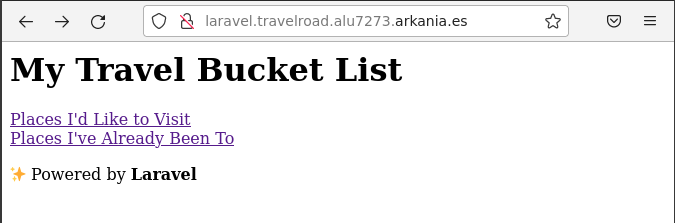
</div>

También en `http://laravel.travelroad.alu7273.arkania.es/visited`:

<div align="center">
  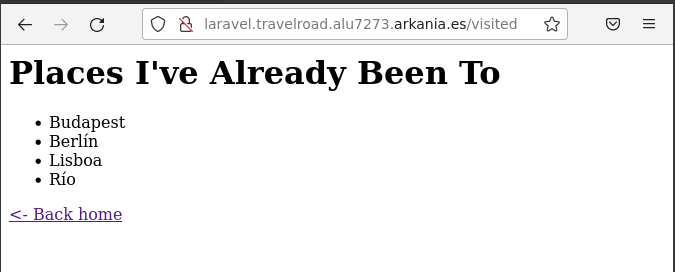
</div>

Comprobamos que funciona correctamente en `http://laravel.travelroad.alu7273.arkania.es/wished`

<div align="center">
  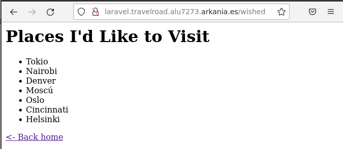
</div>

## Certificado de Seguridad<a name="6"></a>

Finalmente lanzo certbot para crear el certificado de seguridad para `laravel.travelroad.alu7273.arkania.es`:

<div align="center">
  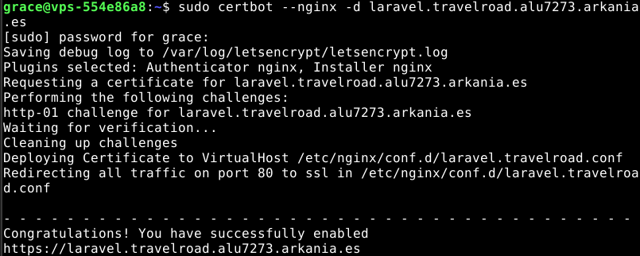
</div>

Comprobamos que funcionan correctamente con el certificado de seguridad para [https://laravel.travelroad.alu7273.arkania.es](https://laravel.travelroad.alu7273.arkania.es)

<div align="center">
  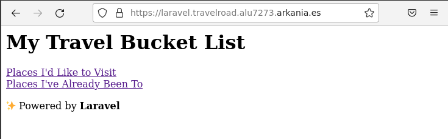
</div>

Comprobamos que funcionan correctamente con el certificado de seguridad para [https://laravel.travelroad.alu7273.arkania.es/visited](https://laravel.travelroad.alu7273.arkania.es/visited)

<div align="center">
  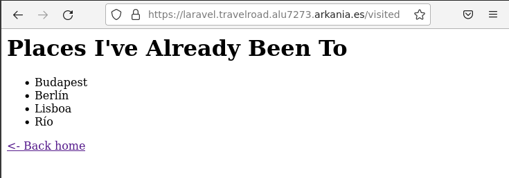
</div>

Y finalmente para [https://laravel.travelroad.alu7273.arkania.es/wished](https://laravel.travelroad.alu7273.arkania.es/wished)

<div align="center">
  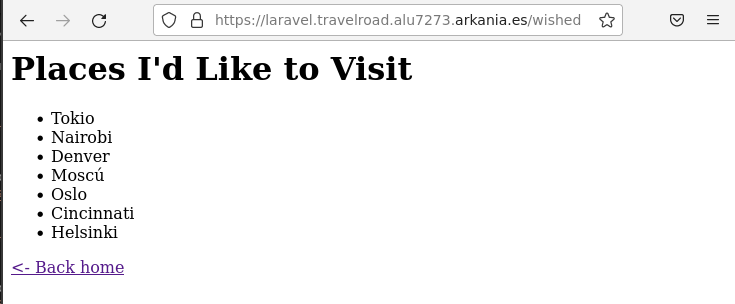
</div>