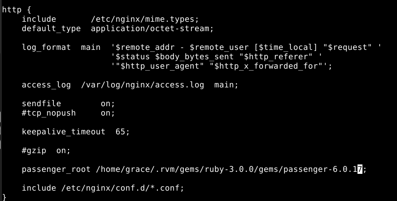

## Ruby on Rails

<div align="center">
  
</div>

**Índice**
1. [Instalación](#1)
2. [Creando la aplicación](#2)
3. [Lógica de negocio](#3)
4. [Probando la aplicación](#4)
5. [Configuración de Nginx](#5)
6. [Probando el despliegue](#6)
7. [Script de despliegue](#7)


A Ruby on Rails también se le conoce RoR o Rails, es un framework de código abierto escrito en el lenguaje de programación Ruby, sigue el patrón Modelo-Vista-Controlador (MVC).

## Instalación<a name="1"></a>

### RVM

Comenzaremos por instalar Ruby Version Manager (RVM) la cual nos permitirá instalar, gestionar y trabajar con múltiples entornos Ruby.

Añadimos las claves GPG:

```
gpg2 --recv-keys \
409B6B1796C275462A1703113804BB82D39DC0E3 \
7D2BAF1CF37B13E2069D6956105BD0E739499BDB
```

<div align="center">
  
</div>

Luego lanzamos el script de instalación:

```
curl -sSL https://get.rvm.io | bash -s stable
```
<div align="center">
  
</div>

Abrimos una nueva pestaña para que los cambios se reflejen y comprobamos la versión de `rvm`:

```
rvm --version
```

<div align="center">
  
</div>

### Ruby

A continuación instalamos Ruby usando `rvm`:

```
rvm install ruby
```

<div align="center">
  
</div>


Establecemos la versión por defecto de Ruby que utilizaremos:

```
bash --login
rvm --default use 3.0.0
echo "source ~/.rvm/scripts/rvm" >> .bashrc
```

<div align="center">
  
</div>


Comprobamos tanto la versión de `Ruby` como la versión de la herramienta `gem` que la usaremos para instalar paquetes:

```
ruby --version
gem --version
```

<div align="center">
  
</div>

### Ruby on Rails

Ya podemos instalar Ruby on Rails:

```
gem install rails
```

<div align="center">
  
</div>


Comprobamos ahora la versión instalada de Ruby on Rails:

```
rails --version
```

<div align="center">
  
</div>


### Requisitos de sistema

Necesitamos instalar libpq una librería de sistema para acceso a bases de datos PostgreSQL:

```
sudo apt install -y libpq-dev
```

<div align="center">
  
</div>

## Creando la aplicación<a name="2"></a>

Rails nos provee de un subcomando para crear una nueva aplicación. En el cual le incluimos el nombre de la aplicación y el tipo de base de datos que vamos a utilizar:

Creamos el directorio RoR, nos posicionamos en él y elecutamos lo siguiente:

```
rails new travelroad --database=postgresql
```

<div align="center">
  
</div>


Vemos la estructura de carpetas y ficheros de `travelroad` y se ve así:

```
ls -l travelroad
```

<div align="center">
  
</div>


Se ha creado un "repositorio git" dentro de esta carpeta. Para que no nos cree conflictos con nuestro propio repositorio borraremos el archivo `.git`. Para ello nos posicionamos en `travelroad` y borramos el archivo:

```
rm -r .git
```
<div align="center">
  
</div>

Para poder establecer la conexión a la base de datos funcione debemos establecer las credenciales de inicio de sesión en PostgreSQL. Para esto usaremos el fichero `database.yml` que se encuentra en config:

```
vi config/database.yml
```

Y modificamos los siguientes apartados por los datos correspondientes a nuestra base de datos:

```
development:
  <<: *default
  username: travelroad_user
  password: *****
  database: travelroad
  host: localhost
  port: 5432

production:
  <<: *default
  database: travelroad
  username: travelroad_user
  password: <%= ENV["TRAVELROAD_DATABASE_PASSWORD"] %>
  host: localhost
  port: 5432
```

>**Nota:** Tener en cuenta que ***** se refiera a la contraseña de nuestro usuario en la base de datos.

<div align="center">
  
</div>
<div align="center">
  
</div>

Lanzamos el servidor para comprobar que toso está funcionando correctamente:

```
bin/rails server
```

Y como nos indica lo abrimos en el puerto 3000, http://localhost:3000 y obtenemos lo siguiente:

<div align="center">
  
</div>

## Lógica de negocio<a name="3"></a>

### Rutas

Para configurar las rutas debemos editar el fichero de `routes` que se encuentra en `config`:

```
vi config/routes.rb
```
Lo configuraremos de la siguiente manera:

```
Rails.application.routes.draw do
  get 'places/index'
  # Define your application routes per the DSL in https://guides.rubyonrails    .org/routing.html

  # Defines the root path route ("/")
  # root "articles#index"
  root "places#index"
 
  get "/", to: "places#index"
  get "/visited", to: "places#visited"
  get "/wished", to: "places#wished"
end
```

<div align="center">
  
</div>

### Modelo

Para generar el código base del modelo utilizamos la herramienta que nos proporciona Ruby on Rails:

```
bin/rails generate model Place
```

<div align="center">
  
</div>

### Controlador

Para crear el código base del controlador utilizamos la herramienta que nos proporciona Ruby on Rails:

```
bin/rails generate controller Places index
```

<div align="center">
  
</div>

Editamos el controlador:

```
vi app/controllers/places_controller.rb
```

El cual se verá así:

```
class PlacesController < ApplicationController
  def index
  end

  def visited
    @visited = Place.where(visited: true)
  end

  def wished
    @wished = Place.where(visited: false)
  end
end
```
<div align="center">
  
</div>

### Vista

Ahora ya solo nos queda crear las vistas de nuestra aplicación, para la ello vamos a utilizar ERB un motor de plantillas sencillo y potente para Ruby.

Comenzamos por editar el fichero principal `index`:

```
vi app/views/places/index.html.erb
```
Con lo siguiente:

```
<h1>My Travel Bucket List</h1>

<a href="wished">Places I'd Like to Visit</a>
<br/>
<a href="visited">Places I've Already Been To</a>

<p>✨ Powered by <strong>Django</strong></p>
```

<div align="center">
  
</div>

A continuación creamos el fichero de `visited`:

```
vi app/views/places/visited.html.erb
```

Con lo siguiente:

```
<h1>Places I've Already Been To</h1>
<ul>
  <% @visited.each do |place| %>
    <li><%= place.name %></li>
  <% end %>
</ul>

<a href="/"><- Back Home</a>
```

<div align="center">
  
</div>

Finalmente creamos el fichero de `wished`:

```
vi app/views/places/wished.html.erb
```

Con lo siguiente:

```
<h1>Places I'd Like to Visit</h1>
<ul>
  <% @wished.each do |place| %>
    <li><%= place.name %></li>
  <% end %>
</ul>
<a href="/"><- Back Home</a>
```

<div align="center">
  
</div>

### Migraciones

Puesto que trabajamos con una base de datos y una tabla previamente creadas, no nos interesa aplicar las migraciones que nos sugiere Ruby on Rails. Por tanto nos dirigiremos al fichero `development.rb` que se encuentra en `config/environments/`:

```
vi config/environments/development.rb
```

Y en este fichero editamos sólo la siguiente línea con valor a `false`:

```
config.active_record.migration_error = false
```

<div align="center">
  
</div>

## Probando la aplicación<a name="4"></a>

Ya podemos probar nuestra aplicación, para ello levantamos el servidor de desarrollo y comprobar que todo funciona correctamente:

```
bin/rails server
```

Como nos indica accedemos a **http://localhost:3000** donde podemos ver:

<div align="center">
  
</div>

**http://localhost:3000/visited**

<div align="center">
  
</div>

**http://localhost:3000/wished**

<div align="center">
  
</div>


## Configuración Nginx<a name="5"></a>

### Passenger

Para poder conectar Nginx con Ruby on Rails necesitamos hacer uso del módulo Passenger. Por tanto procedemos a instalar `passenger`:

```
gem install passenger
```
<div align="center">
  
</div>

Comprobamos la versión de passenger:

```
passenger --version
```

<div align="center">
  
</div>

Vamos a incluir el módulo de passenger de forma dinámica dinámica al Nginx existente.Para esto debemos instalar las dependencias que tiene este módulo para la hora de la compilación:

```
sudo apt install -y libcurl4-openssl-dev libpcre3-dev
```

<div align="center">
  
</div>

Luego descargamos el código fuente de Nginx con la misma versión que el Nginx que tenemos funcionando en el sistema:

```
curl -sL \
https://nginx.org/download/nginx-$(/sbin/nginx -v |& cut -d '/' -f2).tar.gz |
tar xvz -C /tmp
```

<div align="center">
  
</div>

Nos trasladamos al directorio descargado:

```
cd /tmp/nginx-$(/sbin/nginx -v |& cut -d '/' -f2)/
```

<div align="center">
  
</div>

Y realizamos la configuración:

```
./configure \
--add-dynamic-module=$(passenger-config --nginx-addon-dir) \
--with-compat
```

<div align="center">
  
</div>

Luego construimos el módulo dinámico:

```
make modules
```

<div align="center">
  
</div>

Al construir el módulo se nos genera un fichero llamado `ngx_http_passenger_module.so` que copiamos a la carpeta desde la que se cargan los módulos en Nginx:

```
sudo cp objs/ngx_http_passenger_module.so \
/etc/nginx/modules
```

<div align="center">
  
</div>

Cargamos el módulo en la configuración de Nginx, añadiendo la siguiente línea en `/etc/nginx/nginx.conf`:

```
user nginx;
worker_processes auto;

error_log  /var/log/nginx/error.log notice;
pid        /var/run/nginx.pid;

# ↓ Añadir esta línea
load_module /etc/nginx/modules/ngx_http_passenger_module.so;
# ↑ Añadir esta línea 

events {
    worker_connections  1024;
}
...
```

<div align="center">
  
</div>

En el fichero anterior también debemos añadir la ruta raíz de passenger. La podemos averiguar con:

```
passenger-config --root
```

<div align="center">
  
</div>

Añadimos ahora esta ruta al fichero `/etc/nginx/nginx.conf` dentro del bloque `http { ... }` y antes de la línea `include /etc/nginx/conf.d/*.conf;`:

```
...
http {
  ...
  #gzip  on;

  # ↓ Añadir esta línea
  passenger_root /home/sdelquin/.rvm/gems/ruby-3.0.0/gems/passenger-6.0.17;
  # ↑ Añadir esta línea

  include /etc/nginx/conf.d/*.conf;
}
```

<div align="center">
  
</div>

Comprobamos que la sintaxis de `nginx` sea correcta:

```
sudo nginx -t
```

<div align="center">
  
</div>

Como la sintaxis es correcta recargamos `nginx`:

```
sudo systemctl reload nginx
```

<div align="center">
  
</div>

### Host virtual

Creamos un nuevo fichero de configuración para `ror.travelroad`:

```
vi /etc/nginx/conf.d/ror.travelroad.conf
```

Con lo siguiente:

```
server {
    server_name travelroad;

    root /home/grace/RoR/travelroad/public;

    passenger_enabled on;
    passenger_app_env production;
    passenger_env_var TRAVELROAD_DATABASE_PASSWORD *****;
}
```

>**Nota:** Se debe tener en cuenta que ***** es la contraseña para nuestra base de datos.

<div align="center">
  
</div>

Añadimos `ror.travelroad` al localhost:

<div align="center">
  
</div>

## Probando el despliegue<a name="6"></a>

Ahora ya vamos a generar los assets de la aplicación (CSS, Javascript, ...) Para ello nos posicionamos en travelroad y ejecutamos:

```
bin/rails assets:precompile
```

>**Nota:** Esto generará genera los assets en la carpeta `public/assets`. La cual deberá estar fuera del control de versiones.

<div align="center">
  
</div>


Tras todos los cambios realizados reiniciamos el servidor web Nginx:

```
sudo systemctl restart nginx
```

<div align="center">
  
</div>

Finalmente accedemos a **http://ror.travelroad** para comprobar que el resultado es el esperado:

<div align="center">
  
</div>

**http://ror.travelroad/visited**

<div align="center">
  
</div>

**http://ror.travelroad/wished**

<div align="center">
  
</div>

## Script de despliegue<a name="7"></a>

Creamos el script de despliegue [deploy.sh](./deploy.sh)

```
ssh arkania "cd /home/grace/DPL/dpl22-23/UT4/TE2/src/RubyOnRails/travelroad; git pull; bin/rails assets:precompile; passenger-config restart-app ."
```

<div align="center">
  
</div>

Le damos permisos de ejecución a dicho script.

```
chmod +x deploy.sh
```

<div align="center">
  
</div>

>**NOTA:** No podremos desplegar la aplicación en arkania ya que la máquina no tiene la capacidad suficiente para realizar algunos de los pasos anteriores.