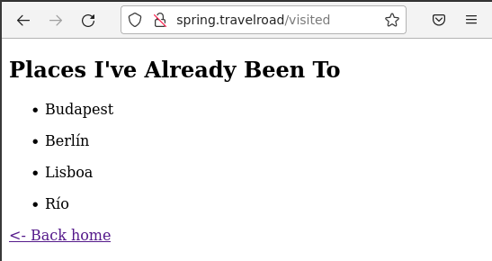

## Spring<a name="2"></a>

<div align="center">
  
</div>

**Índice**
1. [Instalación](#1)
2. [Crear proyecto](#2)
3. [Construcción del proyecto](#3)
4. [Entorno de producción](#4)
5. [Configuración de Nginx](#5)
6. [Script de despliegue](#6)
7. [Despliegue](#7)
8. [Certificado de Seguridad](#8)


## Instalación<a name="1"></a>

### JDK
Debemos comenzar por instalar JDK(Java Development Kit). Para ello ello hacemos lo siguiente:

```
curl -O --output-dir /tmp \
https://download.java.net/java/GA/jdk19.0.1/afdd2e245b014143b62ccb916125e3ce/10/GPL/openjdk-19.0.1_linux-x64_bin.tar.gz
```
<div align="center">
  
</div>

Descomprimimos el paquete de OpenJDK descargado anteriormente en `/usr/lib/jvm`:

```
sudo tar -xzvf /tmp/openjdk-19.0.1_linux-x64_bin.tar.gz \
--one-top-level=/usr/lib/jvm
```
<div align="center">
  
</div>

Comprobamos que todo ha ido bien visualizando el contenido del paquete:

```
ls -l /usr/lib/jvm/jdk-19.0.1/
```

<div align="center">
  
</div>

Modificamos las variables de entorno ubicadas en el fichero `/etc/profile.d/jdk_home.sh`

```
sudo vi /etc/profile.d/jdk_home.sh
```
<div align="center">
  
</div>

Actualizamos las alternativas de los ejecutables `java` y `javac`:

```
sudo update-alternatives --install \
"/usr/bin/java" "java" "/usr/lib/jvm/jdk-19.0.1/bin/java" 0
```
<div align="center">
  
</div>

```
sudo update-alternatives --install \
"/usr/bin/javac" "javac" "/usr/lib/jvm/jdk-19.0.1/bin/javac" 0
```
<div align="center">
  
</div>

```
sudo update-alternatives --set java \
/usr/lib/jvm/jdk-19.0.1/bin/java
```
<div align="center">
  
</div>

```
sudo update-alternatives --set javac \
/usr/lib/jvm/jdk-19.0.1/bin/javac
```
<div align="center">
  
</div>

Ahora comprobamos las verciones de `java` y `javac`:

```
java --version

```
<div align="center">
  
</div>

```
javac --version
```
<div align="center">
  
</div>

> **Nota**: Debemos cerrar la sesión para que los cambios se apliquen correctamente.

### SDKMAN
A continuación instalaremos SDKMAN que nos permitirá gestionar versiones de kits de desarollo:

Comprobaremos primero que tenemos instalado el paquete `zip`:

```
sudo apt install -y zip
```
<div align="center">
  
</div>

Ejecutamos el script de instalación:

```
curl -s https://get.sdkman.io | bash
```
<div align="center">
  
</div>

Activamos el punto de entrada:

```
source "$HOME/.sdkman/bin/sdkman-init.sh"
```
<div align="center">
  
</div>

Comprobamos la version con:

```console
grace@marte17:~$ sdk version
==== BROADCAST =================================================================
* 2023-02-06: jarviz 0.2.0 available on SDKMAN! https://github.com/kordamp/jarviz/releases/tag/v0.2.0
* 2023-02-06: grails 5.3.0 available on SDKMAN!
* 2023-02-06: gradle 8.0-rc-3 available on SDKMAN!
================================================================================

SDKMAN 5.16.0
```

### Spring Boot 

Instalaremos también Spring Boot que es un subproyecto de Spring que nos facilita la preparación de aplicaciones Spring para ponerlas en producción. Para instalarla hacemos uso de SDKMAN:

```
sdk install springboot
```
<div align="center">
  
</div>

Comprobamos la versión con:

```
spring --version
```

<div align="center">
  
</div>

### Maven 

Instalaremos Maven que es una herramienta utilizada para la construcción de proyectos Java que permite la gestión de dependencias. También la instalaremos mediante SDKMAN:

```
sdk install maven
```

<div align="center">
  
</div>

Una vez instalado comprobaremos que todo ha ido bien preguntando por la versión:

```
mvn --version
```

<div align="center">
  
</div>

## Crear proyecto<a name="2"></a>

Creamos el directorio Spring que será donde crearemos la estructura de la aplicación. Y nos posicionamos en dicho directorio: 

<div align="center">
  
</div>

Utilizando Spring Boot creamos la estructura del protecto:

```
spring init \
--build=maven \
--dependencies=web \
--group=edu.dpl \
--name=travelroad \
--description=TravelRoad \
travelroad
```

<div align="center">
  
</div>

Hacemos un `tree` para ver el contenido y la estructura del proyecto:

```
tree travelroad
```

<div align="center">
  
</div>

Cambiamos la estructura del proyecto para cumplir con el objetivo de la aplicación que tenemos que desarrollar. Para ello nos posicionamos en src/main tendremos que organizar los distintos módulos (controlador, modelo y plantilla) que componen la aplicación de la siguiente manera:

```

mkdir -p java/edu/dpl/travelroad/models
touch java/edu/dpl/travelroad/models/Place.java
mkdir -p java/edu/dpl/travelroad/repositories
touch java/edu/dpl/travelroad/repositories/PlaceRepository.java
touch resources/templates/home.html
mkdir -p java/edu/dpl/travelroad/controllers
touch java/edu/dpl/travelroad/controllers/HomeController.java
touch resources/templates/visited.html
touch resources/templates/wished.html
```

<div align="center">
  
</div>

Hacemos un `tree` para ver como ha quedado la estructura de `travelroad/src/main`

<div align="center">
  
</div>

Ahora modifico los archivos creados anteriormente con lo que muestro a continuación:

**HomeController.java**

```
package edu.dpl.travelroad.controllers;

import edu.dpl.travelroad.models.Place;
import edu.dpl.travelroad.repositories.PlaceRepository;
import org.springframework.beans.factory.annotation.Autowired;
import org.springframework.stereotype.Controller;
import org.springframework.ui.Model;
import org.springframework.web.bind.annotation.GetMapping;
@Controller
public class HomeController {
    private final PlaceRepository placeRepository;

    @Autowired
    public HomeController(PlaceRepository placeRepository) {
        this.placeRepository = placeRepository;
    }

    @GetMapping("/")
    public String home(Model model) {
       return "home";  // home.html
    }
    @GetMapping("/visited")
    public String visited(Model model) {
      model.addAttribute("visited", placeRepository.findByVisited(true));
      return "visited";
    }
    @GetMapping("/wished")
    public String wished(Model model) {
      model.addAttribute("wished", placeRepository.findByVisited(false));
      return "wished";
    }
}
```

<div align="center">
  
</div>

**Place.java**
                          
```
package edu.dpl.travelroad.models;

import javax.persistence.Entity;
import javax.persistence.GeneratedValue;
import javax.persistence.GenerationType;
import javax.persistence.Id;
import javax.persistence.Table;

@Entity
@Table(name = "places")
public class Place {

    @Id
    @GeneratedValue(strategy = GenerationType.AUTO)
    private Long id;

    private String name;
    private Boolean visited;

    public Place() {
    }

    public Place(Long id, String name, Boolean visited) {

        this.id = id;
        this.name = name;
        this.visited = visited;
    }

    public Long getId() {
        return id;
    }

    public String getName() {
        return name;
    }

    public void setName(String name) {
        this.name = name;
    }

    public Boolean getVisited() {
        return visited;
    }

    public void setVisited(Boolean visited) {
        this.visited = visited;
    }
}

```
<div align="center">
  
</div>

**PlaceRepository.java**
```
package edu.dpl.travelroad.repositories;

import edu.dpl.travelroad.models.Place;

import java.util.List;
import org.springframework.data.repository.CrudRepository;
import org.springframework.stereotype.Repository;
import org.springframework.data.jpa.repository.Query;
@Repository
public interface PlaceRepository extends CrudRepository<Place, Long> {

    @Query("SELECT p FROM Place p WHERE p.visited = ?1")
    List<Place> findByVisited(Boolean visited);
}
```

<div align="center">
  
</div>


**home.html**

```
<!DOCTYPE HTML>
<html>
<head>
<title>My Travel Bucket List</title>
    <meta http-equiv="Content-Type" content="text/html; charset=UTF-8" />
</head>
<body>
  <h1>My Travel Bucket List</h1>
  <a href="/wished">Places I'd Like to Visit</a>
  <a href="/visited">Places I've Already Been To</a>
  <p>✨Powered by <strong>Spring</strong></p>
</body>
</html>
```

<div align="center">
  
</div>

**visited.html**

```
<!DOCTYPE HTML>                                                             
<html>
<head>
<title>My Travel Bucket List</title>
<meta http-equiv="Content-Type" content="text/html; charset=UTF-8" />
</head>
<body>
    <h2>Places I've Already Been To</h2>
    <ul th:each="place : ${visited}">
      <li th:text="${place.name}"></li>
    </ul>

    <a href="/"><- Back home</a>
</body>
</html>
```


<div align="center">
  
</div>


**wished.html**

```
<!DOCTYPE HTML>                                                             
<html>
<head>
    <title>My Travel Bucket List</title>
    <meta http-equiv="Content-Type" content="text/html; charset=UTF-8" />
</head>
<body>
    <h2>Places I'd Like to Visit</h2>
    <ul th:each="place : ${wished}">
      <li th:text="${place.name}"></li>
    </ul>

    <a href="/"><- Back home</a>
</body>
</html>
```

<div align="center">
  
</div>

Ahora nos trasladamos al raiz del proyecto y editamos el archivo `pom.xml` con lo siguiente:

```
<?xml version="1.0" encoding="UTF-8"?>
<project xmlns="http://maven.apache.org/POM/4.0.0" xmlns:xsi="http://www.w3.org/2001/XMLSchema-instance" xsi:schemaLocation="http://maven.apache.org/POM/4.0.0 https://maven.apache.org/xsd/maven-4.0.0.xsd">
  <modelVersion>4.0.0</modelVersion>
  <parent>
      <groupId>org.springframework.boot</groupId>
      <artifactId>spring-boot-starter-parent</artifactId>
      <version>2.7.5</version>
      <relativePath/> <!-- lookup parent from repository -->
  </parent>
  <groupId>edu.dpl</groupId>
  <artifactId>travelroad</artifactId>
  <version>0.0.1-SNAPSHOT</version>
  <name>travelroad</name>
  <description>TravelRoad</description>
  <properties>
      <java.version>19</java.version>
  </properties>
  <dependencies>
    <dependency>
      <groupId>org.springframework.boot</groupId>
      <artifactId>spring-boot-starter-web</artifactId>
    </dependency>
    <dependency>
      <groupId>org.springframework.boot</groupId>
      <artifactId>spring-boot-starter-test</artifactId>
      <scope>test</scope>
    </dependency>
    <dependency>
      <groupId>org.springframework.boot</groupId>
      <artifactId>spring-boot-starter-thymeleaf</artifactId>
    </dependency>
    <dependency>
        <groupId>org.springframework.boot</groupId>
        <artifactId>spring-boot-starter-data-jpa</artifactId>
    </dependency>
    <dependency>
      <groupId>org.postgresql</groupId>
      <artifactId>postgresql</artifactId>
      <scope>runtime</scope>
    </dependency>
  </dependencies>
  <build>
    <plugins>
      <plugin>
        <groupId>org.springframework.boot</groupId>
        <artifactId>spring-boot-maven-plugin</artifactId>
      </plugin>
    </plugins>
  </build>
</project>   
```

Nos dirigimos a `src/main/resources` y modificamos el archivo `application.properties`

```
spring.datasource.url=jdbc:postgresql://localhost:5432/travelroad
spring.datasource.username=travelroad_user
spring.datasource.password=*********
```
>**Nota**: Debemos cambiar ***** por nuestra contraseña para dicho usuario.

<div align="center">
  
</div>


## Construcción del proyecto<a name="3"></a>

Para que el proyecto esté en funcionamiento debemos inicialmente compilar el proyecto mediante Maven (Maven Wrapper - mvnw). Para compilarlo desde el raíz ejecutamos:

```
./mvnw compile
```

<div align="center">
  
</div>


Una vez compilado debemos empaquetarlo, para ello ejecutamos lo siguiente:

```
./mvnw package
```

<div align="center">
  
</div>

Tras esto, obtendremos un archivo JAR (Java ARchive), lo comprobamos con:

```
file target/travelroad-0.0.1-SNAPSHOT.jar
```

<div align="center">
  
</div>

Lanzamos a correr la aplicacion:

```
java -jar target/travelroad-0.0.1-SNAPSHOT.jar
```
<div align="center">
  
</div>

Comprobamos que está funcionando correctmente en el puerto 8080, con [http://localhost:8080](http://localhost:8080):

<div align="center">
  
</div>

**visited**

<div align="center">
  
</div>

**wished**

<div align="center">
  
</div>

## Entorno de producción<a name="4"></a>

Para hacer el proceso más fácil podemos hacer uso de un script que realice los pasos del proceso de construcción. Para ello creamos el archivo `run.sh`:

```
vi run.sh
```

```
#!/bin/bash

cd /home/grace/Spring/travelroad

./mvnw package  # el empaquetado ya incluye la compilación

# ↓ Último fichero JAR generado
JAR=`ls target/*.jar -t | head -1`
/usr/bin/java -jar $JAR
```

>**Nota:** La ruta a la que nos desplazamos debe ser hacia el raíz del proyecto.

<div align="center">
  
</div>

Cambiamos los permisos de `run.sh` para asignarle los de ejecución:

```
chmod +x run.sh
```

<div align="center">
  
</div>


Luego creamos un servicio (de usuario) para gestionarlo mediante systemd:

```
mkdir -p ~/.config/systemd/user
```

<div align="center">
  
</div>

En la ruta anterior creamos el fichero `travelroad.service`

```
vi ~/.config/systemd/user/travelroad.service
```

Con lo siguiente:

```
[Unit]
Description=Spring Boot TravelRoad

[Service]
Type=simple
StandardOutput=journal
ExecStart=/home/grace/Spring/travelroad/run.sh

[Install]
WantedBy=default.target
```
>**Nota:** A ExecStart se le debe asignar la ruta al script `run.sh`.

<div align="center">
  
</div>

Habilitamos el servicio para que se arranque automáticamente:

```
systemctl --user enable travelroad.service
```

<div align="center">
  
</div>

Iniciamos el servicio para probarlo:

```
systemctl --user start travelroad.service
```

<div align="center">
  
</div>

Podemos comprobar el estado del servicio (tener en cuenta que puede tardar algún tiempo):

```
systemctl --user status travelroad.service
```

<div align="center">
  
</div>

## Configuración de Nginx<a name="5"></a>

Ahora configuramos el host virtual en Nginx para atender a las peticiones. Para ello creamos el archivo de configuración de `spring.travelroad.conf` co lo siguiente:

```
server {
    server_name spring.travelroad;

    location / {
        proxy_pass http://localhost:8080;  # socket TCP
    }
}
```
<div align="center">
  
</div>

Recargamos el servicio de `nginx`:

```
sudo systemctl reload nginx
```

<div align="center">
  
</div>

Añadimos el nuevo servidor `spring.travelroad` a los hosts locales en `/etc/hosts`:

<div align="center">
  
</div>


Comprobamos que ya podemos acceder a `http://spring.travelroad` y funciona correctamente:

<div align="center">
  
</div>

**http://spring.travelroad/visited**

<div align="center">
  
</div>

**http://spring.travelroad/wished**

<div align="center">
  
</div>


## Script de despliegue<a name="6"></a>

Creamos el script de despliegue [deploy.sh](./deploy.sh)

```
#!/bin/bash

ssh arkania "cd /home/grace/DPL/dpl22-23/UT4/TE2/src/Spring/travelroad; git pull; systemctl --user restart travelroad.service"
```

<div align="center">
  
</div>

Le damos permisos de ejecución a dicho script.

```
chmod +x deploy.sh
```

<div align="center">
  
</div>

## Despliegue<a name="7"></a>

Ignoramos el fichero `application.properties` y subimos los archivos al repositorio de `dpl22-23/UT4/TE2`

Nos trasladamos al servidor virtual y hacemos las instalaciones necesarias nombradas en el primer apartado como lo hicimos en local y nos traemos los cambios del repositorio con un `git pull` en `dpl22-23/UT4`

creamos el fichero `application.properties` en la misma ruta que en local, es decir en `travelroad/src/main/resources` con los datos referentes a la base de datos:

```
spring.datasource.url=jdbc:postgresql://localhost:5432/travelroad
spring.datasource.username=travelroad_user
spring.datasource.password=*********
```
>**Nota**: Debemos cambiar ***** por nuestra contraseña para dicho usuario.

<div align="center">
  
</div>

Nos dirigimos a `/etc/nginx/conf.d` y creamos el archivo de configuracion `spring.travelroad.conf`

```
server {
    server_name spring.travelroad.alu7273.arkania.es;

    location / {
        proxy_pass http://localhost:8080;  # socket TCP
    }
}
```
<div align="center">
  
</div>

Recargamos el servicio de nginx:

```
sudo systemctl reload nginx
```

Nos posicionamos en `/DPL/dpl22-23/UT4/TE2/src/Spring` y creamos `run.sh` con sl siguiente contenido para posteriormente crear un servicio que lo llame:

```
#!/bin/bash

cd /home/grace/DPL/dpl22-23/UT4/TE2/src/Spring/travelroad

./mvnw package  # el empaquetado ya incluye la compilación

# ↓ Último fichero JAR generado
JAR=`ls target/*.jar -t | head -1`
/usr/bin/java -jar $JAR
```

>**Nota:** La ruta a la que nos desplazamos debe ser hacia el raíz del proyecto.

<div align="center">
  
</div>

Cambiamos los permisos de `run.sh` para asignarle los de ejecución:

```
chmod +x run.sh
```

Creamos el servicio que apunte a `run.sh` como lo hicimos anteriormente en local.

Una vez creado y levantado el servicio, comprobamos que funciona correctamente accediendo a `http://spring.travelroad.alu7273.arkania.es`

<div align="center">
  
</div>

Comprobamos que funciona correctamente en `http://spring.travelroad.alu7273.arkania.es/visited`

<div align="center">
  
</div>

Comprobamos que funciona correctamente en `http://spring.travelroad.alu7273.arkania.es/wished`

<div align="center">
  
</div>

## Certificado de Seguridad<a name="8"></a>

Finalmente lanzo certbot para crear el certificado de seguridad para `spring.travelroad.alu7273.arkania.es`:

```
sudo certbot --nginx -d spring.travelroad.alu7273.arkania.es
```
<div align="center">
  
</div>

Comprobamos que funcionan correctamente con el certificado de seguridad para [https://spring.travelroad.alu7273.arkania.es](https://spring.travelroad.alu7273.arkania.es)

<div align="center">
  
</div>

Comprobamos que funcionan correctamente con el certificado de seguridad para [https://spring.travelroad.alu7273.arkania.es/visited](https://spring.travelroad.alu7273.arkania.es/visited)

<div align="center">
  
</div>

Y finalmente para [https://spring.travelroad.alu7273.arkania.es/wished](https://spring.travelroad.alu7273.arkania.es/wished)

<div align="center">
  
</div>